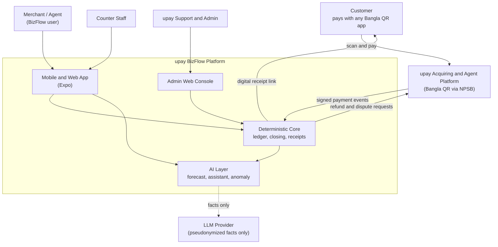

# upay BizFlow — Documentation Index

> **One line:** Other wallets only *take* the money. **upay BizFlow runs the shop after the money arrives.**
>
> A mobile-first, AI-assisted business operating app for **upay merchants and upay agents**. Customers pay through **any** Bangla QR–compatible app (bKash, Nagad, Rocket, bank apps, upay). Every payment then turns into organized records, receipts, daily audit, offers, and AI guidance — the reason a merchant or agent chooses **upay** as their acquirer.

| Item | Value |
|---|---|
| Product name | upay BizFlow |
| Document set version | v1.0 — 2 October 2026 |
| Hackathon tracks | Track 7 (Open Innovation), drawing on Track 5 (Merchant Intelligence) |
| Primary users | Merchants (shopkeepers) and MFS Agents |
| Platforms | Android, iOS, Web (one Expo codebase) + upay Admin web |
| Language | Bangla-first UI, English secondary |
| Team | Mahabub Rahaman (lead), Adiba Tasnim Chowdhury (UI/UX review) |

---

## 1. Why this exists (30-second version)

1. Bangla QR is **interoperable**: a customer using bKash can pay a merchant whose QR is issued by upay. So a merchant who switches to upay **loses no customers**.
2. Since **1 October 2026**, Bangladesh Bank removed the minimum 1% MDR and made merchant settlement **instant** for Bangla QR. *Accepting* a QR payment is now a commodity — every provider offers it cheaply.
3. Therefore the only durable way for upay to win merchants and agents is **what happens after the payment**: books, receipts, reconciliation, audit, supplier planning, offers, and AI guidance.
4. bKash (≈8 lakh+ QR merchants) and others lead on reach. BizFlow is upay's **differentiation layer**, not another QR.

See `01-product-vision-and-strategy.md` for the evidence and sources.

---

## 2. The document set

| # | File | What it answers | Main audience |
|---|---|---|---|
| 00 | `00-README.md` | What is this, where is everything | Everyone |
| 01 | `01-product-vision-and-strategy.md` | Problem, market evidence, competition, value proposition, personas | Judges, upay business |
| 02 | `02-users-roles-permissions.md` | The 5 roles + customer, permission matrix, account model | Product, backend |
| 03 | `03-features-and-user-flows.md` | Every module and the step-by-step flows (merchant, agent, offers, customer, admin) | Product, frontend |
| 04 | `04-ui-ux-design-system.md` | Screens, navigation, wireframes, design tokens, Bangla typography, accessibility | Design, frontend |
| 05 | `05-system-architecture.md` | Tech stack, components, event flow, offline sync, scaling to national level | Engineering |
| 06 | `06-data-model-and-ledger.md` | Database schema, double-entry ledger, state machines, RLS | Backend |
| 07 | `07-api-specification.md` | REST/RPC endpoints, webhooks, idempotency, errors | Backend, frontend |
| 08 | `08-ai-ml-specification.md` | All AI capabilities, models, features, evaluation, guardrails, MLOps | AI/ML |
| 09 | `09-security-privacy-compliance.md` | Threat model, controls, Bangladesh regulation mapping, privacy | Security, judges |
| 10 | `10-implementation-roadmap.md` | Hackathon build phases (hour by hour) + Pilot → City → National | Whole team |
| 11 | `11-testing-qa-devops.md` | Test strategy, CI/CD, monitoring, incident runbooks | Engineering |
| 12 | `12-business-model-kpis-pitch.md` | Economics, KPIs, rollout, pitch narrative, demo script, judging map | Judges, upay business |
| 13 | `13-ai-build-playbook-and-skills.md` | How to build this fast with Claude/ChatGPT: skills (skills.sh), CLAUDE.md, phase prompts | Builders |
| 14 | `14-role-separation-and-ai-insights.md` | Merchant and Agent as two independent role-based systems, separate login, and the Today's Insights AI layer | Builders, Product |

---

## 3. Product at a glance

### System context (C4 level 1)




```text
Customer pays with ANY app via Bangla QR (acquired by upay)
        │
        ▼
upay payment event ──► BizFlow ledger (auto entry, double-entry, immutable)
        │                         │
        │                         ├─► Digital receipt (+ offer / stamp progress) to customer
        │                         ├─► Merchant: sales, baki, suppliers, daily closing
        │                         └─► Agent: cash-in/out/send-money book, float audit, commission
        ▼
AI layer (advice only) ── forecast · float forecast · match suggestions · anomaly flags
                         · daily briefing · Bangla assistant · voice entry · offer advisor
                         · report builder · health explanation
        │
        ▼
Owner decides. The system never moves money by itself.
```

### Roles (details in file 02)

| Role | Where | Summary |
|---|---|---|
| Merchant Owner | Mobile app | Full shop control |
| Agent Owner | Mobile app | Full agent-point control |
| Staff | Mobile app | Limited counter work, own shift only |
| upay Support | Web admin | Cases, disputes, refunds (reason-logged access) |
| upay Super Admin | Web admin | Portfolio KPIs, campaigns, AI health, kill switches |
| Customer | Receipt link (no login) | Pays, receives receipt and offer progress |

### Navigation (details in file 04)

- **Merchant tabs:** Home · Transactions · **[QR]** · Books · Offers
- **Agent tabs:** Home · Transactions · **[QR]** · Float · Offers
- **Staff tabs:** QR · My Transactions · Add Cash Sale · My Shift

---

## 4. Golden rules (apply to every file)

1. **Money truth is deterministic.** Ledger, balances, settlement, refunds, permissions, fees → fixed rules and database constraints. Never an AI output.
2. **AI advises, the owner decides.** AI never transfers, withdraws, refunds, blocks, or edits records.
3. **Every AI output shows:** what, why, which data, confidence, and what the user can do.
4. **AI can fail safely.** If any AI service is down, payments, ledger, receipts and closing keep working; AI cards fall back to simple baselines or hide.
5. **Append-only books.** Nothing financial is edited or deleted — only reversed and replaced, with an audit entry.
6. **Bangla first, three things at a time.** A screen shows at most three action items. Colour + number + one sentence.
7. **Privacy by default.** Minimum customer data, explicit consent for loyalty/marketing, no secrets in the app.
8. **Hackathon honesty.** Real upay/NPSB APIs are simulated behind an adapter with the same contract; slides say so.

---

## 5. Key sources used across the set

- Bangladesh Bank Bangla QR reforms effective 1 Oct 2026 (instant settlement, MDR floor removed, ≈39 lakh merchant points): [The Daily Star, 30 Sep 2026](https://www.thedailystar.net/business/news/bangla-qr-payments-become-cheaper-instant-merchants-tomorrow-bb-4286986)
- Bangla QR dispute & auto-refund guideline effective 1 Dec 2026: [The Daily Star](https://www.thedailystar.net/business/news/bb-sets-strict-timelines-bangla-qr-payment-dispute-resolution-4284271), [The Daily Star — auto refund](https://www.thedailystar.net/business/economy/news/customers-get-auto-refund-if-bangla-qr-transactions-fail-4284581)
- Bangla QR history and risks: [TBS, 29 Sep 2026](https://www.tbsnews.net/supplement/bangla-qr-building-foundation-cash-lite-bangladesh-1557011)
- MFS market shares: [The Daily Star, 16 Jul 2026](https://www.thedailystar.net/business/news/tk-6000cr-moves-daily-not-every-wallet-winning-4220811)
- bKash Bangla QR network: [Dhaka Tribune, 22 Jul 2026](https://www.dhakatribune.com/business/415730/bkash-deploys-largest-bangla-qr-network-nationwide)
- MFS monthly statistics (Oct 2025): [The Financial Express](https://thefinancialexpress.com.bd/trade/mfs-transactions-maintain-rising-trend-in-oct-25)
- Personal Data Protection Ordinance 2025: [Asia News Network summary](https://asianews.network/?p=234602)
- MFS Regulations 2022: [Bangladesh Bank PDF](https://www.bb.org.bd/aboutus/regulationguideline/psd/mfs_regulations_2022.pdf)
- ICT Security Guideline v4 (2023): [Bangladesh Bank PDF](https://www.bb.org.bd/aboutus/regulationguideline/brpd/jun192023_ictsecurityv4.pdf)
- Digital khata competitor (TallyKhata): [tallykhata.com](https://www.tallykhata.com/million-shopkeepers-using-tallykhata-app-for-records-and-payments/)
- Expo SDK 56 (RN 0.85, React 19.2): [expo.dev/sdk/56](https://expo.dev/sdk/56)
- Agent skills: [skills.sh](https://www.skills.sh/), [Expo skills](https://docs.expo.dev/skills/)

> Regulatory facts move quickly. Before any production decision, upay Legal, Compliance and Payment Operations must confirm the current rule text. Figures above are from news reports, not the official circulars.
