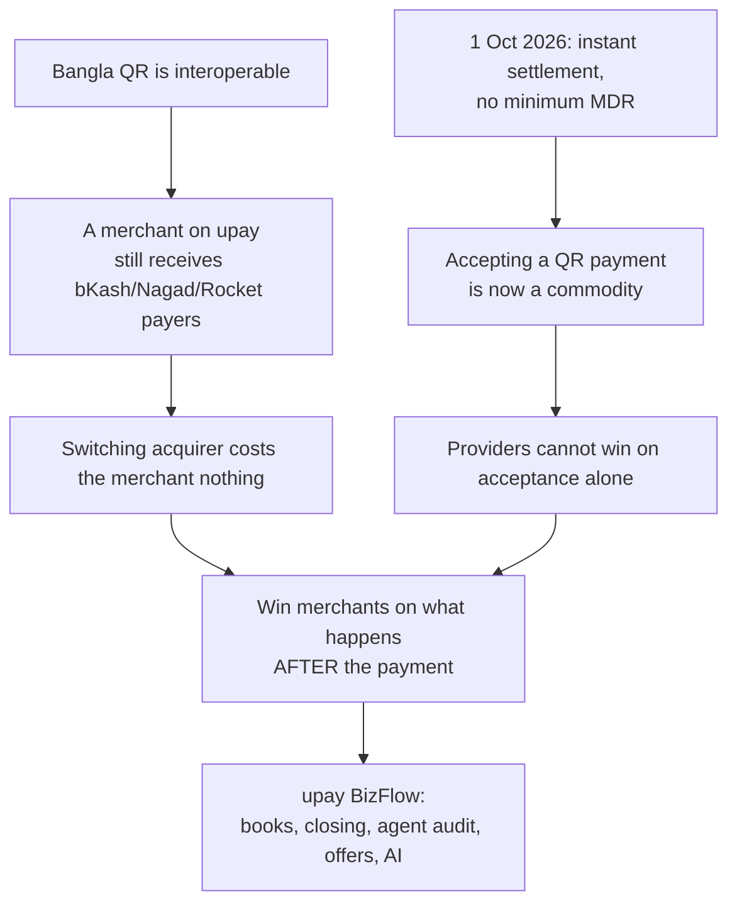

# 01 — Product Vision & Strategy

## 1. Vision

> **Make upay the platform a Bangladeshi shopkeeper or agent chooses to run their business — not just to receive money.**

BizFlow turns every incoming payment into organized, trustworthy business information and gives the owner simple, AI-assisted guidance: *what happened today, what may happen next, and what to do now.*

## 2. Problem statement

> Bangladeshi micro-merchants and MFS agents handle hundreds of payments and cash movements a day across several wallets, cash drawers and paper notebooks. Payments simply "happen": there is no organized list of where money came from or went, customers get no proper receipt, the day-end count rarely matches, supplier dues and *baki* live in memory, and owners withdraw money without knowing what they will need tomorrow. Existing wallet apps stop at "payment received". Since Bangla QR is interoperable and (from 1 October 2026) instantly settled with no minimum MDR, accepting a payment is no longer a differentiator. upay needs a reason for merchants and agents to choose upay as their acquirer and primary platform.

## 3. Market evidence (as of October 2026)

| Fact | Figure | Why it matters to BizFlow | Source |
|---|---|---|---|
| Bangla QR merchant points | ≈ 39 lakh (3.9 M) | Huge base, but provider choice is open — winnable | [Daily Star 30 Sep 2026](https://www.thedailystar.net/business/news/bangla-qr-payments-become-cheaper-instant-merchants-tomorrow-bb-4286986) |
| Bangla QR daily usage | ≈ 3.5 lakh txns/day, ≈ Tk 143.5 crore/day (up 3.5× volume, 5× value in 90 days) | Usage is accelerating now — timing is right | same |
| Pricing reform (1 Oct 2026) | Minimum 1% MDR removed; IRF set to zero; instant settlement for all merchants | Acceptance is commoditized → compete on value-added services | same |
| Government incentive | 0.10% to acquirers, 0.20% to issuers per NPSB-routed txn (txns up to Tk 2,000) | Acquiring merchants is now directly rewarded for upay | same |
| Dispute guideline (effective 1 Dec 2026) | Auto-reversal ≤ 30 min, complaint window 45 days, issuer decision 2 working days, chargeback 7 days, arbitration 30 days, merchant refund request 60 days | BizFlow's dispute/refund module can be the compliant, transparent merchant-side workflow | [Daily Star](https://www.thedailystar.net/business/news/bb-sets-strict-timelines-bangla-qr-payment-dispute-resolution-4284271) |
| Competitor reach | bKash: 8 lakh+ QR merchants, >Tk 200 crore/day, cashback offers, payment speakers, merchant financing pilot | Leader competes on reach + promotions; not on day-end books/agent audit | [Dhaka Tribune 22 Jul 2026](https://www.dhakatribune.com/business/415730/bkash-deploys-largest-bangla-qr-network-nationwide) |
| MFS active users | bKash 4.20 crore, Nagad 2.82 crore; 14 licensed providers; ≈Tk 6,000 crore/day | upay is a challenger and must differentiate | [Daily Star 16 Jul 2026](https://www.thedailystar.net/business/news/tk-6000cr-moves-daily-not-every-wallet-winning-4220811) |
| Cash dominance | Cash-in 26.1% and cash-out 23.5% of MFS value (Oct 2025) | Agents are central; reducing cash-out keeps money in wallets | [Financial Express](https://thefinancialexpress.com.bd/trade/mfs-transactions-maintain-rising-trend-in-oct-25) |
| Digital khata demand | TallyKhata: 1 M+ monthly active shopkeepers (baki + SMS tagada + Bangla QR) | Shopkeepers *want* digital books; BizFlow adds auto-capture from payments + AI | [TallyKhata](https://www.tallykhata.com/million-shopkeepers-using-tallykhata-app-for-records-and-payments/) |
| Known QR risks | QR tampering, fake merchant identity, social engineering, unauthorised txns, low digital literacy | Must be designed in from day one (file 09) | [TBS 29 Sep 2026](https://www.tbsnews.net/supplement/bangla-qr-building-foundation-cash-lite-bangladesh-1557011) |

> All figures are from news reports. Validate against official Bangladesh Bank circulars before external use.

## 4. Why upay, why now

1. **Interoperability removes the switching cost.** A merchant with an upay-acquired Bangla QR still receives money from bKash, Nagad, Rocket and bank users.
2. **Pricing parity removes the price war.** With MDR floor gone and instant settlement mandatory, nobody wins on "cheaper/faster settlement" alone.
3. **The gap is post-payment.** Market leaders compete on reach and cashback. No one makes the *daily life* of a shopkeeper and an agent easier end-to-end.
4. **upay's bank parent (UCB)** gives a credible path to future regulated services (accounts, working capital via partners) once trust and data exist — explicitly *out of scope* for the MVP.

## 5. Competitive positioning

| Capability | Typical wallet merchant app | Digital khata apps | **upay BizFlow** |
|---|---|---|---|
| Accept Bangla QR from any app | Yes | Yes (some) | Yes |
| Auto ledger from payments | Partial (statement) | No (manual) | Yes automatic, double-entry |
| Cash + digital in one book | No | Yes manual | Yes (digital auto + cash quick entry) |
| Baki (customer credit) + reminders | No | Yes | Yes |
| Daily closing / drawer audit | No | No | Yes hero feature |
| Agent cash-in/out/send-money book + float audit | No | No | Yes |
| Supplier dues planning | No | Partial | Yes |
| Digital receipt for every payment | Partial | SMS | Yes link + SMS, with offer progress |
| Merchant-funded offers / stamp cards | Provider-funded campaigns | No | Yes merchant-controlled + AI advisor |
| AI forecast / safe-to-withdraw | No | No | Yes |
| Bangla voice entry & assistant | No | No | Yes |
| Dispute workflow aligned to 2026 BB guideline | Provider-side | No | Yes merchant-side tracker |

**Positioning statement:** *For Bangladeshi shopkeepers and MFS agents who lose time and money to messy books, BizFlow by upay is a Bangla-first business app that turns every payment into clean records, receipts and AI guidance — unlike other wallets that stop at "payment received".*

## 6. Personas

### 6.1 Karim — neighbourhood grocery (Merchant Owner)
- 45, Mirpur, Dhaka; Android phone (mid/low-end); reads Bangla comfortably, little English.
- 60–120 sales/day, ~35% digital; 4 suppliers on weekly cycles; ~Tk 25k of *baki* outstanding.
- Pain: evening count never matches; forgets supplier due dates; withdraws cash then is short on Saturday.
- Wins with BizFlow: auto list of all QR payments, 2-tap cash sale, daily closing, supplier reminders, "safe to withdraw today".

### 6.2 Rahim — MFS agent point (Agent Owner)
- 32, Savar; runs 2–3 wallets from one shop; 150+ cash-in/out/send-money per day.
- Pain: no organized list of what came from where; customers ask for proof; float runs out at 5 pm; commission unclear; day-end drawer vs e-money mismatch.
- Wins with BizFlow: auto upay transaction book, manual entries for other wallets in the same book, receipt to customer, float forecast, end-of-day audit, commission view.

### 6.3 Shila — counter staff (Staff)
- 22, works at a campus cafeteria. Needs: show QR, confirm "money arrived", add cash sale, close her shift. Must not see owner's totals.

### 6.4 Customer — Tania
- Pays with bKash at Karim's shop. Wants: verified shop name, proof of payment, refund status, and a reason to come back (stamp card).

### 6.5 upay Support — Nafis; Super Admin — upay product lead
- Nafis resolves disputes within regulatory timelines with full evidence.
- Product lead tracks merchant acquisition, activity, retention, wallet balance retention, offer ROI, AI health.

## 7. Value for each side

| Merchant / Agent | Customer | upay |
|---|---|---|
| Automatic books from payments | Verified merchant name | New merchant & agent acquisition |
| Cash + digital in one place | Instant digital receipt | Higher merchant payment volume (+ NPSB acquirer incentive) |
| Daily closing / float audit | Purchase history & refund status | Retention: switching away means losing your books |
| Supplier & baki control | Loyalty stamps & offers | Wallet balance retention, lower cash-out |
| AI forecast, safe-to-withdraw | Clear dispute evidence | Rich, consented data for future UCB/partner services |
| Merchant-funded offers that bring customers back | | Platform brand: "upay = business partner" |

## 8. Product principles

1. **Payment is the start, not the end.**
2. **Zero extra work for digital sales** — they appear automatically.
3. **Two taps for anything manual** (cash sale, expense, baki).
4. **Show the decision, not the chart** — "keep Tk 40,000 cash for 5 pm", not a graph to interpret.
5. **AI everywhere, but small** — one "AI suggestion" card per screen; never crowds the UI.
6. **Trust over cleverness** — append-only books, visible formulas, confidence labels, "insufficient data" when needed.
7. **Merchant control** — nothing irreversible happens without the owner's tap.

## 9. Scope boundaries

**In scope (MVP):** merchant & agent books, QR receive, receipts, cash/expense/baki entry, suppliers, daily closing & float audit, offers & stamp cards, disputes/refunds tracker, AI layer (file 08), staff, admin web.

**Out of scope (MVP):** real fund movement initiated by BizFlow, lending/credit scoring, inventory management (beyond optional category demand), payroll, tax filing, integration with non-upay wallet APIs (other wallets are manual entries only).

## 10. Success definition

| Horizon | Success looks like |
|---|---|
| Hackathon | Judges see the full loop live: payment → receipt → book → closing → AI advice → offer → admin KPIs, on a phone, in Bangla |
| Pilot (3 months, 100 merchants + 50 agents) | ≥ 60% weekly active, ≥ 50% close the day ≥ 4×/week, digital share +10 pp, measurable drop in day-end variance |
| City (6–9 months) | 10,000 merchants/agents; upay acquiring share up in pilot areas; retention ≥ 70% at 90 days |
| National | BizFlow is the default upay merchant/agent experience; contributes to UCB merchant services |

KPI formulas are in `12-business-model-kpis-pitch.md`.

---

## 11. Update: October 2026 UI redesign

The product promise is unchanged; how it feels to use it changed (full detail in
`16-ui-redesign.md`):

- **Familiar first screen.** Home leads with the balance and a 4 x 2 service grid in the
  shape MFS users already know, instead of a wall of AI text. AI is one slim line on top.
- **Proven money vs. written money.** Every amount shows whether upay verified it or the
  owner wrote it by hand. This makes BizFlow's core differentiator (auto-books from any
  Bangla QR payment) visible on every row.
- **MFS-grade sign-in.** OTP once, then a 5-digit device PIN with a "Forgot PIN?" reset,
  like the wallets shopkeepers already use.
- **Calm, trustworthy feel.** Minimal motion, soft optional sounds and haptics, no flashy
  effects in money flows.
- **Demo without infrastructure.** The whole app runs on realistic sample data with no
  backend (`pnpm --filter mobile web:demo`), useful for pitches, user tests and UI work.
