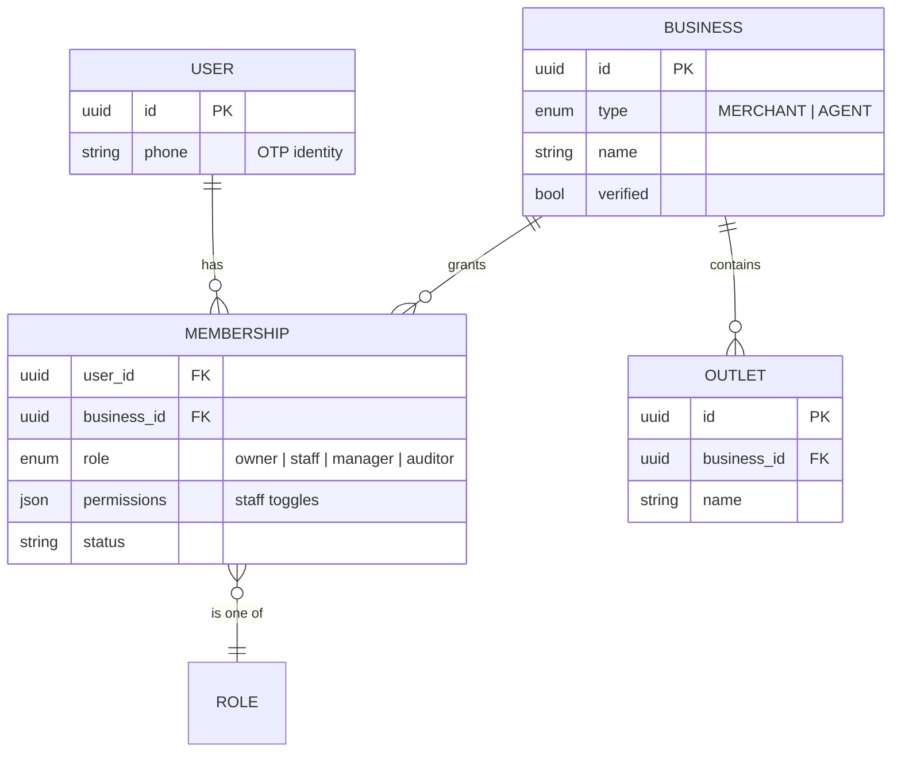
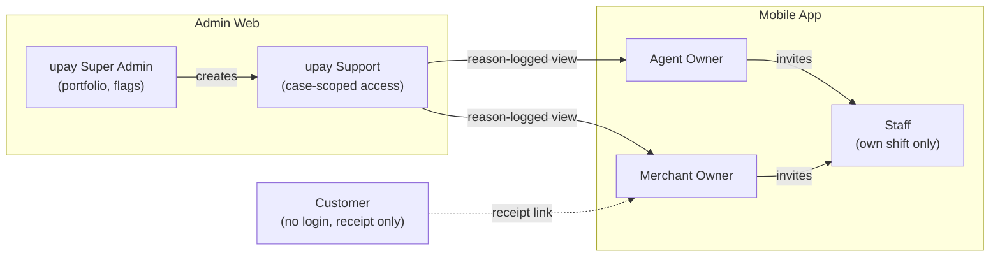

# 02 — Users, Roles & Permissions

## 1. Account model

### Account model (entity relationships)




```text
Person (user)            ── one phone number, one Supabase Auth identity
  └── Membership(s)      ── user ↔ business, with a role
        └── Business     ── type: MERCHANT | AGENT   (one person may own both)
              └── Outlet(s)  ── physical shop / counter (MVP: 1 outlet, schema supports many)
```

- One app. After OTP login, the server returns the user's memberships. The UI renders the **Merchant** or **Agent** experience based on the active business type.
- If a person holds more than one membership (e.g. owns a shop that is also an agent point), a header switch **`Shop ⇄ Agent`** changes the active business. The switch changes the JWT claim `active_business_id` via a server call; the client never chooses data scope on its own.
- A user can **never** type a business ID to see another business. All access is derived server-side from `memberships` and enforced by PostgreSQL Row Level Security (RLS).

## 2. The roles

### Role landscape




Five authenticated roles + the unauthenticated customer.

| # | Role | Code | Surface | Created by |
|---|---|---|---|---|
| 1 | Merchant Owner | `merchant_owner` | Mobile app | Self-onboarding + upay verification |
| 2 | Agent Owner | `agent_owner` | Mobile app | upay agent onboarding (existing agent number) |
| 3 | Staff | `staff` | Mobile app (restricted) | Invited by an Owner |
| 4 | upay Support | `upay_support` | Web admin | Super Admin |
| 5 | upay Super Admin | `upay_admin` | Web admin | Bootstrap / another Super Admin (dual control) |
| — | Customer | `anon` (no login) | Receipt web page | — |

### Future roles (schema-ready, not built in MVP)

| Role | Purpose |
|---|---|
| `manager` | Owner-delegated bookkeeping and closing without security settings |
| `auditor` | Read-only evidence and audit logs (compliance) |
| `field_officer` | Onboards and visits merchants/agents; sees onboarding status, not books |
| `distributor` | Sees aggregate float health of its agent network |

## 3. Role descriptions

### 3.1 Merchant Owner
Everything for their shop: transactions, receipts, books (cash sales, expenses, baki), suppliers, daily closing, planner & forecast, offers, reports/exports, staff management, refunds/disputes, AI assistant, settings.
**Cannot:** see other businesses; edit/delete posted ledger entries (only reverse); move money from BizFlow.

### 3.2 Agent Owner
Everything for their agent point: auto transaction book (cash-in, cash-out, send money, payments), manual entries for other wallets, e-float and cash drawer, float forecast, day-end audit, commission view, customer receipts, offers (agent-funded only, regulated charges untouched), staff, AI assistant.
**Cannot:** change regulated cash-out/cash-in charges; see other agents' data.

### 3.3 Staff
Show QR, see **own** transactions and own shift, add cash sale/expense (if allowed), mark a payment as "customer confirmed", send receipt, close own shift.
**Cannot:** see business balance, forecasts, safe-to-withdraw, reports, offers settings, supplier list, other staff's data, exports.

### 3.4 upay Support
Search a business **only with a case/reason**, view transactions and evidence needed for the case, manage dispute/refund cases, contact merchant. Every view is logged (`access_log`) and visible to the business owner in "Who viewed my data".
**Cannot:** create or alter ledger entries, change balances, export bulk data, change roles.

### 3.5 upay Super Admin
Portfolio dashboard (aggregate KPIs), merchant/agent lifecycle (approve, restrict), upay-funded campaigns, AI model health & kill switches, feature flags, role management (with dual approval for granting admin).
**Cannot:** silently read individual books without a logged reason; edit ledger entries.

### 3.6 Customer (no login)
Opens a receipt link (`/r/{receipt_token}`): sees verified merchant name, amount, time, transaction ID, refund status, loyalty/offer progress (only if they opted in). Can tap "Report a problem" which creates a dispute request tied to that receipt.

## 4. Permission matrix

Legend: Yes allowed · Limited limited (own items / with reason) · No denied

| Capability | Merchant Owner | Agent Owner | Staff | upay Support | Super Admin |
|---|:-:|:-:|:-:|:-:|:-:|
| Show QR / receive payment | Yes | Yes | Yes | No | No |
| View all transactions | Yes | Yes | Limited own shift | Limited case-scoped | Limited aggregate; drill-down with reason |
| Add cash sale / expense | Yes | Yes | Limited if enabled | No | No |
| Add manual entry (other wallet) | Yes | Yes | Limited if enabled | No | No |
| Reverse/correct an entry | Yes (reason) | Yes (reason) | No | No | No |
| Baki (customer credit) | Yes | Yes | Limited add only | No | No |
| Suppliers & payables | Yes | — | No | No | No |
| Daily closing (business) | Yes | Yes | No | No | No |
| Shift closing (own) | Yes | Yes | Yes | No | No |
| Reopen a closed day | Yes (re-auth + reason) | Yes (re-auth + reason) | No | No | No |
| Float & drawer audit | — | Yes | Limited count only | No | No |
| Forecast / planner / safe-to-withdraw | Yes | Yes | No | No | Limited model metrics only |
| AI assistant | Yes full scope | Yes full scope | Limited own-shift scope | Limited support copilot | Limited admin copilot |
| Offers: create / pause | Yes | Yes | No | No | Limited upay campaigns |
| Refund request | Yes (re-auth) | Yes (re-auth) | No | Limited process | No |
| Dispute case | Yes view/respond | Yes view/respond | No | Yes manage | Limited oversight |
| Reports & export | Yes (audited) | Yes (audited) | No | No | Limited aggregate only |
| Manage staff | Yes | Yes | No | No | No |
| Security settings (PIN, devices) | Yes | Yes | Limited own | No | No |
| Feature flags / kill switch | No | No | No | No | Yes (dual control for global) |
| Restrict a business | No | No | No | Limited propose | Yes (reason, logged) |

## 5. Staff permission toggles (owner-controlled)

| Toggle | Default |
|---|---|
| Can add cash sales | On |
| Can add expenses | Off |
| Can add baki | Off |
| Can add other-wallet manual entries (agent) | Off |
| Can send receipts | On |
| Can see today's shift total | On |
| Max single cash-sale amount without owner approval | Tk 5,000 |

## 6. Authentication & session rules

| Rule | Value |
|---|---|
| Login | Phone + OTP (Supabase Auth, SMS provider in Bangladesh) |
| App unlock | 4–6 digit app PIN or device biometrics (expo-local-authentication) |
| Access token lifetime | 15 minutes (JWT), refresh token rotation |
| Idle lock | 5 min (owner), 15 min (staff on shared counter device, but shift-scoped) |
| Re-authentication required for | refund, reopen day, export, add/remove staff, change payout/security, view full customer phone |
| Device binding | New device login → notify owner on existing devices; owner can revoke |
| Admin web | SSO/email + TOTP MFA mandatory; IP allow-list in production |
| Staff on shared device | "Switch user" with staff PIN; each action stamped with actor ID |

## 7. Enforcement design (defence in depth)

1. **UI** hides what the role cannot do (convenience only, not security).
2. **API / RPC** checks role + business membership in every server function (`assert_member(business_id, required_role)`).
3. **PostgreSQL RLS** on every table: `business_id IN (select business_id from memberships where user_id = auth.uid() and status='active')`, plus role predicates.
4. **Column-level masking** via views: staff views exclude balance columns; support views mask customer phone (`01•••••789`).
5. **Audit**: every privileged action writes `audit_events` (append-only, hash-chained).

## 8. Onboarding flows by role

| Role | Steps (MVP demo) | Production addition |
|---|---|---|
| Merchant Owner | Phone → OTP → business name, category, location type → opening cash & balance → upay merchant QR shown → optional suppliers | upay merchant KYC (NID + trade licence where required), QR issuance via upay acquiring, bank/wallet payout verification |
| Agent Owner | Phone → OTP → agent number linked (simulated) → opening e-float & cash → wallets used (upay + others for manual entries) | Verify against upay agent registry, distributor linkage |
| Staff | Owner adds staff phone + permissions → staff gets SMS invite → OTP → set PIN | Device approval by owner |
| Support / Admin | Created in admin console | SSO + MFA, quarterly access review |

---

## 9. Update: October 2026 UI redesign (sign-in and access)

- **Two doors, one auth.** The welcome screen offers a shop door and an agent door; the
  account's real role from `me()` is still the authority, and a mismatch points the user to
  the right door (docs/14).
- **Device PIN.** After the first OTP sign-in on a device the user creates a 5-digit PIN.
  The PIN unlocks the app on that device only; it is stored as a salted, iterated SHA-256
  hash on the device and never sent to the server. Five wrong tries remove it and force an
  OTP reset ("পিন ভুলে গেছেন?"). Signing out also removes it. See docs/16 section 6.
- **Lock now.** Settings can lock the app immediately (shared counter phones).
- **What each role sees.** The Home service grid only shows tiles the member may use:
  staff without `can_add_entries` see no entry tiles; suppliers, closing, planner and
  review are owner/manager only; reports and commission are owner only. The server still
  enforces every rule; hiding a tile is convenience, not security.
