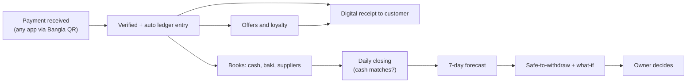
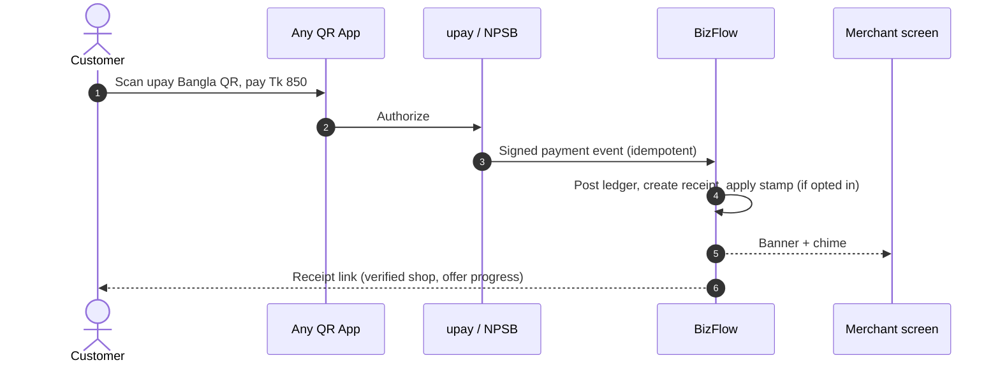

# 03 — Features & User Flows

Priority legend: **P0** = must exist in hackathon demo · **P1** = build if time allows / pilot · **P2** = production roadmap.
= AI-assisted (specified in `08-ai-ml-specification.md`).

---

## 1. Module map

| ID | Module | Merchant | Agent | Priority |
|---|---|:-:|:-:|:-:|
| M1 | Onboarding & profile | Yes | Yes | P0 |
| M2 | QR receive & payment inbox | Yes | Yes | P0 |
| M3 | Digital receipts | Yes | Yes | P0 |
| M4 | Books (ledger): cash sale, expense, manual entry | Yes | Yes | P0 |
| M5 | Baki (customer credit) | Yes | Yes | P1 |
| M6 | Suppliers & payables | Yes | — | P0 |
| M7 | Reconciliation & review queue | Yes | Yes | P0 |
| M8 | Daily / shift closing | Yes | Yes | P0 |
| M9 | Float & drawer audit | — | Yes | P0 |
| M10 | Planner: forecast, safe-to-withdraw, what-if | Yes | Yes (float) | P0 |
| M11 | Offers & loyalty | Yes | Yes | P0 |
| M12 | Business health & KPIs | Yes | Yes | P0 |
| M13 | AI daily briefing | Yes | Yes | P0 |
| M14 | Bangla AI assistant (text + voice) | Yes | Yes | P0 |
| M15 | Reports & AI report builder | Yes | Yes | P1 |
| M16 | Refunds & disputes | Yes | Yes | P1 |
| M17 | Staff & shifts | Yes | Yes | P1 |
| M18 | Notifications | Yes | Yes | P0 |
| M19 | Customer receipt page | — | — | P0 |
| M20 | upay Admin: support console | — | — | P1 |
| M21 | upay Admin: portfolio & AI health | — | — | P0 |
| M22 | Supplier invoice OCR | Yes | — | P2 |
| M23 | Offline mode & sync | Yes | Yes | P1 (cash entries) |
| M24 | SMS/USSD day summary | Yes | Yes | P2 |

---

## 2. Module details

### M1 — Onboarding & profile
- Welcome (language, **Shop** or **Agent point** door) → phone → OTP → create a 5-digit device PIN → business name, category (grocery, pharmacy, restaurant, stationery, electronics, service, online seller, agent), location type (campus, market, residential, highway), opening hours, closed day.
- Opening balances: cash in drawer, wallet/e-float balance.
- Shows the **upay Bangla QR** (demo: generated EMVCo-style payload; production: issued by upay acquiring).
- Optional: add up to 3 suppliers (merchant), add other wallets used (agent).
- Language: Bangla (default) / English, switchable on the welcome screen and in Settings.
- Onboarding asks one question per screen (type, name, category, opening cash, opening wallet/float) with a progress bar (docs/16).
- Consent screen: data use for books & AI (required), loyalty/customer messaging (optional, separate).

### M2 — QR receive & payment inbox
- **[QR] centre button**: static QR always; "Ask for amount" creates a dynamic QR with amount + optional reference (order/invoice number).
- On payment event: sound + vibration + big green banner "Received Tk 850 — from bKash" (payer app name only; payer identity masked).
- Transactions has two tabs: **Digital** (provider-verified) and **Manual book** (hand-written). Each tab has its own today in/out summary, filter chips and search; rows are grouped by day. Verified rows carry a green check badge, manual rows a pen badge on a paper tint, so the two never mix (docs/16 section 2).
- Inbox filters (today/7d/custom, status, amount range, source app, staff) and search (txn ID, reference, amount).
- Each item shows **separate statuses**: Payment (received/failed/reversed) · Settlement (instant/pending) · Match (matched/suggested/review) · Closing (included/not) · Dispute (none/open/resolved).
- Agent inbox shows type chips: Cash-in · Cash-out · Send money · Payment · Manual (other wallet).

### M3 — Digital receipts
- Every upay payment auto-creates a receipt with a short unguessable token link (`bizflow.app/r/AB12CD34`).
- Delivery: share sheet (WhatsApp/Messenger/SMS), QR-to-receipt on screen, optional SMS (P1, cost-controlled).
- Content: verified merchant name + badge, amount, date-time, transaction ID, payment source, reference, refund status, offer/stamp progress (if opted in).
- Agents: receipt for cash-in/cash-out/send money (customer proof — reduces "I didn't get the money" disputes).

### M4 — Books (ledger)
- **Quick cash sale:** amount keypad → category chip (optional) → Save. ≤ 2 taps after amount.
- **Detailed sale:** items/categories, customer (optional), discount, baki portion.
- **Expense:** amount → type (supplier purchase, rent, electricity, transport, salary, other) → paid from (cash/wallet) → photo (optional).
- **Voice entry:** hold [mic], say (in Bangla) "five hundred taka cash sale, biscuits" → parsed draft → owner confirms.
- **Auto-categorize** expenses from free text.
- **Manual other-wallet entry (agent):** "bKash cash-out Tk 2,000" — labelled *Manual*, never mixed with verified upay records. The entry asks the direction: *customer took cash* (wallet up, drawer down) or *customer gave cash* (drawer up, wallet down). The cash-in direction needs `p_direction` on `post_manual_wallet` (docs/07, docs/16 section 7).
- **Corrections:** no edit/delete. In the transaction detail sheet, "Wrong? Correct it" (owner, manual rows) asks a reason, re-authenticates and posts a reversal; the original stays visible, struck through and marked Reversed.
- Every entry screen shares one frame: amount on top, options in the middle, keypad and the amber Save at the bottom, then a confirmation with the Manual badge and "Add another".
- Views: Today · Day list · Category · Cash vs Digital.

### M5 — Baki (customer credit)
- Customer list (name + optional phone, consent flag) with balance.
- "Gave baki Tk 300" / "Received Tk 500" (TallyKhata-style simple verbs: "gave" / "received").
- Reminder: owner taps → pre-filled Bangla SMS/WhatsApp text with upay QR link to pay. Never auto-sent.
- Suggest who to remind first (oldest + largest + historically pays after reminder).

### M6 — Suppliers & payables (merchant)
- Supplier profile: name, phone, category, usual cycle (weekly/bi-weekly/monthly), active flag.
- Invoice/payable: amount, invoice ref, due date, photo, status (Draft → Confirmed → Partially paid → Paid / Overdue / Disputed / Cancelled).
- Payment record: full / partial / mark as cash-paid / schedule (reminder only — no auto-pay).
- Recurring cycle creates **Draft** payables; owner confirms.
- Priority suggestion when cash is tight (file 08 §AI-11, P1).

### M7 — Reconciliation & review queue
- Exact match: payment reference = open invoice/order/baki reference → auto-matched.
- Suggested match: score from amount, time proximity, partial reference, staff/counter, customer history. Owner taps Accept/Reject.
- Review queue reasons: missing reference, amount mismatch, possible duplicate, reversed, partial refund, unusual pattern.
- Actions: Match · Keep unmatched · Defer · Open support case. Every decision → audit.

### M8 — Daily / shift closing (hero feature)
1. Tap **"Close the day"**.
2. System shows: digital received (by source), cash sales recorded, expenses (cash/wallet), refunds/reversals, baki given/received, **expected cash in drawer**.
3. Owner enters **counted cash**: count notes (1000 ... 1, totals add themselves) or type the total. The screen runs in three steps: today's summary, count, match and close.
4. Variance shown with colour: [OK] = 0, [WATCH] ≤ tolerance (default Tk 100), [ALERT] > tolerance.
5. Blockers: material unmatched payment (> Tk 2,000 default) or open review items → must resolve or close **with exception + reason**.
6. Closing receipt generated (versioned, immutable): period, totals, variance, exceptions, closed by, time, note.
7. Reopen = re-auth + reason → new version; old version retained.
8. After closing: daily briefing + forecast refresh.

Shift closing = same flow scoped to one staff member's transactions and drawer.

### M9 — Float & drawer audit (agent)
- Live: e-float (upay balance, auto) · other-wallet floats (manual) · cash drawer (expected).
- Movements: cash-in raises cash drawer & lowers e-float; cash-out does the reverse — explained visually.
- Day-end audit in three steps: count the drawer (note counter), confirm upay e-float (verified) and each other wallet (manual), then review every difference with a status word before saving.
- Float forecast: hourly cash & e-float demand for next 24 h; "Keep at least Tk 40,000 cash by 4 pm" with range.
- Rebalance suggestion (P1): "At current pace e-float runs out ≈ 3:30 pm".

### M10 — Planner (merchant) / Float planner (agent)
- 7-day chart: daily inflow range (lower/central/upper), known outflows (supplier dues, recurring expenses), projected closing balance band.
- **Safe-to-withdraw** card with visible formula (deterministic; file 08 §6).
- **What-if:** sliders/inputs — withdraw amount, move supplier payment date, sales −/+%, reserve change, large refund. Calculation only; source data unchanged.
- Confidence label + "Why?" sheet (data period, drivers, limitations).

### M11 — Offers & loyalty
Offer types:

| Type | Example | Mechanics |
|---|---|---|
| Percent off | 10% off above Tk 300 | Applied by merchant at counter; receipt records it |
| Flat off | Tk 50 off | same |
| Stamp card | 5 purchases → 1 free tea | Stamps counted from receipts of opted-in customers |
| Spend threshold gift | Tk 1,000 in a month → gift | Monthly accumulator |
| Happy hour | 3–5 pm 5% off | Time-boxed |
| Win-back | Customers absent 30 days → Tk 30 off | Requires opt-in contact |
| Agent loyalty | 5 upay transactions → small gift | Agent-funded; never alters regulated fees |

Flow: Offers tab → **Create** (3 steps: type → budget & dates → audience) → preview of customer receipt → Publish.
- Budget cap auto-pauses offer when spent.
- Offer advisor: suggests day/time/type from slow periods; estimates uplift range; after the offer, measures **incremental** sales vs. a comparison (holdout days/customers) — honest ROI.
- Customer sees offer and stamp progress on receipt. Customer identity for stamps = hashed phone or receipt-linked token, only with consent.
- Guardrails: no deceptive countdowns, no targeting by sensitive attributes, merchant-funded, clear terms.

### M12 — Business health & KPIs
Deterministic KPIs, each with formula on tap; AI writes the plain-Bangla explanation.

| KPI | Formula |
|---|---|
| Sales trend | Last 30 d sales ÷ previous 30 d − 1 |
| Digital share | Digital sales ÷ total sales |
| Closing discipline | Days closed ÷ open days (30 d) |
| Day-end variance | Σ abs(variance) ÷ Σ expected cash |
| Supplier pressure | Dues next 7 d ÷ projected available balance |
| Baki exposure | Outstanding baki ÷ avg weekly sales |
| Refund rate | Refunded value ÷ completed sales |
| Repeat-customer rate | Returning identified customers ÷ identified customers |
| Reserve coverage | Available reserve ÷ avg daily operating expense (days) |
| Float stress (agent) | Hours with float < threshold ÷ open hours |

Health status [OK]/[WATCH]/[ALERT] = rule-based thresholds on the KPIs (no hidden score).

### M13 — AI daily briefing (Today's Insights home)
After login the home screen is a role-scoped "Today's Insights" feed, not a chatbot: a
prioritised list of cards (sales or liquidity outlook, cash-flow or peak-hour, customer
activity, attention, pending) built by `today_insights`, in Bangla and English. Numbers come
from the ledger and facts views; the AI only phrases them. A Merchant sees merchant insights
and an Agent sees agent insights, never the other's. Full design in docs/14.

### M14 — Bangla AI assistant
Note: in the current product the AI is delivered as the Today's Insights layer (M13), not as
a chat product; there is no "Ask AI" chatbot button. The read-only assistant tools remain in
the AI service for internal/report use. Text or voice entry (hold-to-talk) feeds the parse
endpoint for quick entry, with the draft always confirmed before it is saved.

### M15 — Reports & AI report builder
Standard: daily closing, sales by day/category, cash vs digital, expenses, suppliers, baki, refunds/disputes, offers, agent transaction book, commission.
Builder: a spoken/typed request like "give me a sheet of last month's supplier accounts" → mapped to a predefined template + filters → preview → export CSV/XLSX/PDF (owner only, audited, link expires 15 min).

### M16 — Refunds & disputes
- Refund: from original payment → amount (≤ refundable remaining) → reason → re-auth → submitted to provider (simulated) → Processing → Succeeded/Failed → linked ledger reversal.
- Concurrency guard: refunds cannot exceed original amount even with parallel requests (DB constraint + row lock).
- Dispute case: case ID, payment, reason, amount, owner, **deadline countdown** aligned to BB 2026 timelines (configurable), evidence upload, status, resolution, ledger impact.
- Auto-reversal events (failed txn reversed by issuer ≤ 30 min) shown as "Reversed automatically" — not a merchant refund.

### M17 — Staff & shifts
Invite, permissions (file 02 §5), start/end shift, per-staff collection, revoke device.

### M18 — Notifications
In the app, the bell on Home opens a Notifications screen. Until a notifications table exists it lists today's insights, most urgent first (docs/16 section 7).

| Event | Channel | Lock-screen text |
|---|---|---|
| Payment received | In-app sound + push | "BizFlow: new payment" (amount hidden by default; owner can enable) |
| Review needed | Push | "BizFlow needs your attention" |
| Day not closed by closing time + 1 h | Push | same |
| Supplier due tomorrow | Push | same |
| Float low (forecast) | Push | same |
| Dispute deadline < 24 h | Push + SMS | same |
| New device login | Push + SMS | "New login on your account" |

### M19 — Customer receipt page
Static, fast, no login, `noindex`. Report-a-problem → creates dispute request with receipt token. Rate-limited.

### M20 / M21 — upay Admin
See file 04 §7 and file 02.

---

## 3. End-to-end flows

### The core value chain (one glance)



### Customer payment and offer (sequence)




### Flow A — Merchant: a normal day
```text
08:00  Briefing: "Yesterday Tk 18,400. Supplier Rahman Traders Tk 15,000 due Saturday. Safe to withdraw today: Tk 6,000."
09:00–21:00
   Customer scans QR (bKash) → payment event → sound + banner → ledger auto-entry → receipt link
   Cash sale: keypad Tk 120 → Save
   Expense: "electricity bill 800" via voice → confirm
   Review queue: "Tk 2,450 likely Invoice #1048 (92%)" → Accept
21:30  Close day → counted Tk 12,000 vs expected Tk 12,300 → [WATCH] Tk 300 → note "change given wrong" → Close
21:31  Closing receipt + forecast refresh → Planner: safe-to-withdraw today Tk 6,000 (lowest-day algorithm)
```

### Flow B — Agent: a normal day
```text
Open shop: confirm opening cash Tk 60,000 and e-float Tk 50,000
Each upay cash-in/cash-out/send money → auto in book with type chip → receipt to customer
Other-wallet cash-out → Manual entry (2 taps) → labelled "Manual"
14:00 "Cash-out demand likely high 4–7 pm. Keep ≥ Tk 40,000 cash." 
Close: counted cash vs expected; e-float vs upay balance; commission today Tk 1,840 → [OK]
```

### Flow C — Customer payment & offer
```text
Scan upay Bangla QR with any app → pay Tk 850 → issuer confirms
→ BizFlow receives event (webhook, idempotent) → ledger → receipt link shown on merchant screen/QR
→ Customer opens receipt: verified "Karim Store (verified)", Tk 850, txn ID, "Offer: 2 more visits → free tea" (if opted in)
```

### Flow D — Refund
Original payment → Refund → amount ≤ remaining → reason → PIN/biometric → Processing → Succeeded → ledger reversal linked → customer receipt shows "Refunded Tk 200".

### Flow E — Dispute
Customer "Report a problem" or support call → case created with deadline clock → merchant notified → merchant uploads evidence (receipt, closing record) → support decides → ledger impact posted if any → both sides see resolution.

### Flow F — What-if
Planner → "If I withdraw Tk 15,000 today?" → Saturday balance Tk 4,500, Tk 7,500 below the Tk 12,000 reserve [ALERT] → suggestion "Withdraw Tk 6,000 now, the rest after Sunday's sales" → nothing changes until owner acts outside BizFlow.

### Flow G — Offer lifecycle
Create → publish → receipts show offer → budget tracker → auto-pause at cap → results: "Incremental sales ≈ Tk 4,200–Tk 6,100 on offer days vs Tk 1,500 cost".

### Flow H — Support access
Support agent opens case → requests business view with case ID → access granted for 60 min, scoped → `access_log` → owner sees "upay support viewed 3 transactions for case #D-1042".

---

## 4. Edge cases checklist

| Case | Required behaviour |
|---|---|
| Duplicate webhook | Idempotency key → single ledger entry |
| Payment event arrives before app online | Server-side ledger; app syncs on reconnect |
| Offline cash sale | Stored in local outbox with client UUID; synced idempotently; conflict-free (append-only) |
| Clock skew on device | Server timestamp is authoritative; client time stored separately |
| Refund > remaining | Rejected with clear message |
| Partial refund then dispute | Disputed amount ≤ remaining net amount |
| Closing with pending settlement | Allowed; shown as "pending", not counted as cash |
| Day reopened after forecast | Forecast re-generated, old run kept |
| Staff leaves | Revoke → sessions killed, history retained with actor ID |
| New merchant, < 14 days data | Forecast shows "not enough history" or category baseline with Low confidence |
| Offer budget exhausted mid-day | Auto-pause, notify owner, receipts stop showing offer |
| AI service down | AI cards show "AI suggestions temporarily unavailable"; core flows unaffected |

---

## 5. Update: October 2026 UI redesign

Screen-by-screen layouts for every module above are in `16-ui-redesign.md` section 4.
Behaviour changes are folded into M1, M2, M4, M8, M9 and M18. The Home "Today's
Insights" feed (M13) is now a slim one-line strip with a pager, opening a sheet that lists
every card with a "Why?" view of its facts.
