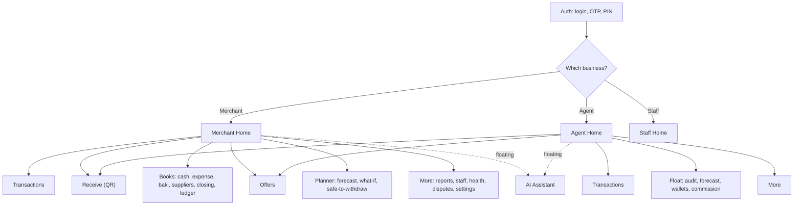
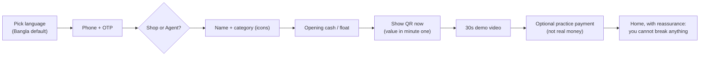

# 04 — UI/UX & Design System

> This file defines **how BizFlow looks, feels and behaves**. It is written for a specific, hard user: a Bangladeshi micro-merchant or MFS agent, often 35–55, on a low-end Android phone, in bright sunlight, with **limited reading ability and little prior app experience**. Every decision below is justified against research and against how real competitors behave. If a choice does not help *that* user make money or save time, it is wrong.
>
> **All UI copy in the product ships in Bangla first with an English toggle.** In this document, every label is written in English (shown as `"English label"` / *intended meaning*) so the spec is fully English; the microcopy table in §17 is the source of truth for the Bangla strings to be placed in `bn.json`.

---

## 1. Research foundation (why our UI is shaped this way)

We did not design from taste. We designed from evidence on how low-literacy, novice users actually succeed or fail with mobile interfaces.

| Finding | Source | What it forces in BizFlow |
|---|---|---|
| **0%** of low-literacy users completed a banking task on a **text-based** UI; **72%** succeeded with **voice**; **100%** with **graphical** UIs | Medhi/Thies, Microsoft Research — [ToCHI paper](https://www.microsoft.com/en-us/research/wp-content/uploads/2016/02/ToCHI2711_Medhi.pdf) | Core actions must be reachable by **picture + number + voice**, never by reading a sentence |
| Low-literacy users fail at **hierarchical menus** (56/90 couldn't navigate) and **scrolling** (48/90 didn't understand vertical scroll) | same | **Flat** navigation; money-making actions on one screen; avoid deep menus and hidden scroll for primary tasks |
| **Numbers** are read far more reliably than words by semi-literate users | same | Lead with the amount; words are support, not the message |
| Graphics should be **simple, self-explanatory, consistent in position**; context video helps first use | same | Fixed icon set, fixed positions, 30-second local-language demo clips |
| Serve **local language first**; replicate the familiar paper *khata*; make **incremental** changes; **SMS** builds trust; **talk to users weekly** | Khatabook (10M+ merchants) — [YourStory](https://yourstory.com/2021/08/product-roadmap-fintech-startup-khatabook-10-million-msme-users/amp) | Bangla-first, "gave/received" verbs, SMS receipts, a review loop with pilot merchants, no radical redesigns after launch |
| 2026 fintech UX = **trust shown upfront, one value per screen, color never used alone, progressive disclosure, empowering (non-judgmental) tone** | Eleken, OneThing, ProCreator — [Eleken](https://www.eleken.co/blog-posts/fintech-ux-best-practices), [OneThing](https://www.onething.design/post/top-10-fintech-ux-design-practices-2026), [ProCreator](https://procreator.design/blog/emerging-fintech-ui-ux-trends/) | Verified badges + lock cues, one headline number per screen, icon+word+color for status, "safe to withdraw today" framing not "don't overspend" |
| Designing for "Bharat": big tap targets, voice, vernacular, low-data, works offline | [BillCut](https://www.billcut.com/blogs/fintech-ux-design-for-bharat-simple-apps-for-everyone/) | 48dp+ targets, voice entry, offline cash entry, light assets |

**One-line design philosophy:**

> **See it, don't read it. One number, one action, one tap. Say it if you can't tap it. Never let the shopkeeper feel they can break it.**

---

## 2. Competitive UX teardown (what others do, what we take / avoid)

| App | What they do well | Where they fall short for our user | BizFlow's move |
|---|---|---|---|
| **bKash** | Trusted brand, big send-money grid, verified merchant name, payment sound/speaker ([UX case study](https://uxplanet.org/improving-the-send-money-experience-of-the-worlds-leading-mfs-app-bkash-a-ux-case-study-28052938cbe6)) | Consumer wallet, not a business tool; no books, closing or day-end view; dense icon grid | Keep the trusted "payment confirmed" moment and verified name; replace the icon grid with a **3-answer Home** (today / next / do now) |
| **Nagad** | Clean, bold numerals, strong color | Same consumer framing; little for merchant operations | Borrow bold numerals; aim at operations |
| **Khatabook / OkCredit** | Replicates paper *khata*; gave/received verbs; 13 languages; SMS to customer; huge rural adoption | Manual entry only (no auto-capture from payments); no agent float; no forecasting | Keep the *khata* mental model + SMS; **add** auto-capture from upay payments, agent book, AI forecast |
| **TallyKhata** | Bangla-first, Bangla QR, baki + SMS reminder, 1M+ shopkeepers ([tallykhata.com](https://www.tallykhata.com/million-shopkeepers-using-tallykhata-app-for-records-and-payments/)) | Bookkeeping-centric; limited agent & planning depth | Match its simplicity bar; differentiate on **daily closing, float audit, safe-to-withdraw, AI** |

**Lesson absorbed:** the winners in this market are *simple and familiar*, localized, and build trust with SMS and verified identity. The losers over-feature. BizFlow must out-simplify, not out-feature — and hide its (considerable) power behind a calm surface.

---

## 3. Design principles (the rules every screen obeys)

1. **One screen, one question.** Home answers "how is my shop today?" Closing answers "does my cash match?" The title states the question.
2. **Number first, word second.** The biggest thing on any card is the taka amount. Labels are small.
3. **Three, not thirty.** At most **3 action items** and **1 AI card** visible at once. More lives behind an "More" item.
4. **Picture + word + color for every status** — never color alone (color-blind safe, and readable by non-readers). Green dot + "all good".
5. **Tap, or say it.** Every primary input also has a voice ([mic]) path.
6. **Thumb-first.** Primary actions sit in the bottom 40% of the screen (see §7).
7. **You can't break it.** Reversible by default; destructive actions need re-auth; copy reassures ("fixable if wrong").
8. **Familiar before clever.** Mirror the paper khata and the bKash payment moment before introducing anything new.
9. **Trust is visible.** Verified badge, lock icon on money actions, "upay verified" on receipts.
10. **Calm, not busy.** Generous whitespace, one accent color, no decorative gradients, no more than 2 type sizes per card.
11. **Fast and light.** Works on 3 GB RAM, cold start < 3 s, degrades gracefully offline.
12. **Incremental forever.** After launch, change behavior slowly; keep positions stable (Khatabook's hard-won lesson).

---

## 4. Information architecture

### Sitemap




```text
App (Expo Router)
├── (auth)        login · otp · pin-setup · choose-business
├── (merchant)    tabs: home · transactions · qr · books · offers
│     ├── books/  cash-sale · expense · baki · suppliers · closing · ledger
│     ├── planner/   forecast · what-if · safe-to-withdraw
│     └── more/      reports · staff · health · disputes · settings · who-viewed
├── (agent)       tabs: home · transactions · qr · float · offers
│     ├── float/    audit · forecast · wallets · commission
│     └── more/      (same as merchant minus suppliers)
├── (staff)       tabs: qr · my-transactions · add-cash · my-shift
├── assistant     modal (floating button)
├── r/[token]     public receipt page (web)
└── admin/        web-only: support · portfolio · campaigns · ai-health · flags · audit
```

**Navigation depth rule:** a primary task is reachable in **≤ 2 taps** from its tab and never requires scrolling to find the main button. Deep/rare features may nest, but money-making actions never do.

---

## 5. Navigation model

| Experience | Bottom tabs (centre = raised QR button) — English label / *meaning* |
|---|---|
| Merchant | Home · Transactions · **[QR]** · Books · Offers |
| Agent | Home · Transactions · **[QR]** · Float · Offers |
| Staff | **[QR]** · My Transactions · Add Cash Sale · My Shift |

- **Fixed bottom tab bar**, max 5 items, each with **icon + label** (icon alone fails low-literacy users; label alone fails too — always both).
- **Raised centre QR button** — the single most important action (receive money) is the biggest, most central, always-present control. This is the bKash-learned "one obvious money button".
- Top bar: business name + verified (verified) · `Shop ⇄ Agent` switch (only if the person owns both) · notifications · profile.
- Floating **assistant** button bottom-right, above the tab bar; hidden on the QR screen so nothing competes with receiving money.
- **No hamburger menu** for primary functions (hidden menus fail novice users). "More" is an explicit labelled item, not a mystery icon.

---

## 6. Color system

### 6.1 Rationale
Fintech trust leans on **blue** (stability, security) with a **green** success language and a single warm **accent** for the primary call-to-action ([Progress](https://www.progress.com/blogs/how-choose-right-colors-fintech), [Adobe](https://www.adobe.com/express/learn/blog/best-color-combinations-that-build-trust)). We anchor on a deep **upay-compatible blue** as the brand/structure color, reserve **amber** for the primary action button (high visibility in sunlight, distinct from status colors), and use a **traffic-light status set** that always pairs with icons so it works for color-blind users and non-readers.

> The hex values below are a **working placeholder palette**. Swap them for upay's official brand tokens before release — but keep the *roles* and the *contrast ratios*.

### 6.2 Tokens (light theme)

| Token | Hex | Role | Contrast note |
|---|---|---|---|
| `brand.primary` | `#0B4EA2` | Headers, structure, brand | 8.6:1 on white — AAA |
| `brand.primaryDark` | `#083A7A` | Pressed/active brand | — |
| `action.primary` | `#F59E0B` | **The main CTA button** (Save, Receive, Close day) | Dark text on it → 8.9:1 |
| `action.primaryText` | `#1A1300` | Text on amber button | — |
| `bg` | `#F7F8FA` | App background | — |
| `surface` | `#FFFFFF` | Cards | — |
| `text` | `#111827` | Primary text | 16.1:1 on surface — AAA |
| `text.muted` | `#5B6472` | Secondary labels | 5.2:1 — AA (never used for amounts) |
| `status.good` | `#15803D` | Matched / all good / money in | pairs with icon |
| `status.good.bg` | `#DCFCE7` | Good chip background | — |
| `status.warn` | `#B45309` | Needs attention / small variance | — |
| `status.warn.bg` | `#FEF3C7` | — | — |
| `status.bad` | `#B91C1C` | Shortfall / failed / big variance | — |
| `status.bad.bg` | `#FEE2E2` | — | — |
| `ai.tint` | `#EEF2FF` | AI card background | — |
| `ai.border` | `#6366F1` | AI card left accent + | — |
| `manual.tag` | `#6B7280` | "Manual" (unverified) label | — |
| `verified` | `#15803D` | Verified (verified) badge | — |
| `divider` | `#E5E7EB` | Hairlines | — |

### 6.3 Dark theme (auto + manual toggle)
`bg #0B1220` · `surface #111A2E` · `text #F3F4F6` · status colors lightened (`good #4ADE80`, `warn #FBBF24`, `bad #F87171`), amber action kept. All pairs re-checked to ≥ 4.5:1.

### 6.4 Hard color rules
- **Money amounts are always `text` (near-black), never colored** — color is reserved for *status*, so a red number is never confused with a red "problem".
- **Status = color + icon + word.** Red alone is banned.
- **Only one amber CTA per screen.** Two amber buttons = a design bug.
- **Sunlight test:** every screen must pass at ~40% brightness outdoors; that's why text is near-black on near-white and the CTA is high-chroma amber.
- Minimum contrast: body ≥ 4.5:1, large text/amounts ≥ 3:1 (we hold amounts to ≥ 7:1), UI icons ≥ 3:1 (WCAG 2.2).

---

## 7. Layout & thumb zones

Phones are held one-handed while the other hand gives change. We design for the **thumb arc**.

```text
┌───────────────────────┐  ← TOP (hard to reach):
│  status, info, title  │     read-only info, business name, notifications
│                       │
│   content / numbers   │  ← MIDDLE: scannable info, the big amount
│                       │
│                       │
│  [ PRIMARY ACTION ]   │  ← BOTTOM 40% (easy thumb zone):
│  bottom tab bar       │     primary CTA + navigation live here
└───────────────────────┘
```

- Primary CTA is a **full-width amber button pinned above the tab bar**.
- Destructive/secondary actions are smaller, higher, or in an overflow — deliberately *harder* to hit.
- Keypads (cash sale, PIN) use **large bottom-anchored keys** with the Save/confirm key reachable without re-gripping.
- Base spacing unit **8dp**; card padding 16dp; min gap between tappables 8dp.

---

## 8. Typography

### 8.1 Bangla-first type
- **Bangla:** `Hind Siliguri` (primary) / `Noto Sans Bengali` (fallback) — designed for on-screen legibility of Bangla conjunct clusters (juktakkhor). **Latin/numerals:** `Inter`.
- Bangla needs **more line-height** than Latin: `lineHeight ≥ 1.5` for body, 1.3 for large numbers; never clip vowel marks — test ascenders/descenders.
- **Numerals:** default to **Bangla digits** with a user toggle to Latin (some merchants prefer Latin for money). Group in the **lakh system**: 12,34,567.

### 8.2 Type scale (minimums tuned for older eyes / sunlight)

| Role | Size | Weight | Use |
|---|---|---|---|
| Hero number | 40 | 700 | The one amount a screen is about |
| Big number | 32 | 700 | Secondary key amounts |
| Title | 20 | 600 | Screen question / card title |
| Body | 16 | 400/500 | Default text (**never below 16**) |
| Label | 14 | 500 | Field labels, chips |
| Caption | 13 | 400 | Timestamps, fine print (never for money or actions) |

- No text smaller than 13; interactive text ≥ 16.
- Support OS font-scaling to **200%** without breaking layout (test early — Bangla reflows differently).
- Max ~45 Bangla characters per line for comfortable reading.

---

## 9. Iconography

- **One consistent, simple set** (outline + filled states), each icon paired with a label in navigation and actions. Icons alone are ambiguous for novices — labels are mandatory on primary controls.
- Prefer **concrete, culturally familiar metaphors**: receipt, sale, supplier, cash drawer, lock, verified (verified). Avoid abstract symbols (hamburger, kebab) for primary functions.
- **Payment source** shown with the payer app's known mark (bKash/Nagad/Rocket/upay) so merchants recognize "where the money came from" instantly.
- Icon min size 24dp, touch target 48dp.
- First-time use: a 30-second **demo clip** per core screen (video beats static help for novices).

---

## 10. Core components

| Component | Behavior & rules |
|---|---|
| `MoneyText` | Tk + lakh grouping; Bangla/Latin per setting; near-black; `accessibilityLabel` reads the full amount aloud for screen readers/TTS |
| `StatusPill` | good/warn/bad/neutral = bg tint + icon + word; never color-only |
| `AICard` | `ai.tint` bg, indigo left accent + (AI), ≤ 2 lines, **confidence chip** (high/medium/low), "Why?" opens a plain-language bottom sheet (what/why/data/action), yes/no feedback |
| `ActionList` | max 3 rows, each icon + one line + chevron; overflow → "More" |
| `AmountKeypad` | large keys incl. `00`, haptic per key, [mic] inline, Save pinned bottom (amber) |
| `PrimaryButton` | amber, full-width, 56dp tall, dark text, pressed state; **one per screen** |
| `ReauthSheet` | PIN/biometric before refund/reopen/export/staff; FLAG_SECURE on |
| `RangeChart` | forecast band (p10/p50/p90) + obligation markers; day-name axis labels; **one takeaway sentence under the chart** so users needn't read the chart |
| `TxnRow` | source mark · amount (near-black) · time · StatusPills; `Manual` grey tag if unverified |
| `ReceiptCard` | shared app/web; verified shop + (verified), amount, time, txn id, offer progress |
| `EmptyState` | friendly line + illustration + single CTA ("nothing yet — add your first sale") |
| `OfflineBanner` | "offline — 3 entries waiting to sync"; non-blocking |
| `ConfirmSheet` | for irreversible actions: restates amount + consequence, two clear buttons (no tiny "x") |
| `VoiceSheet` | hold-to-talk, live waveform, shows recognized draft for confirmation (never auto-commits) |

---

## 11. Motion, sound & haptics (critical for this user)

For a user who may not read the confirmation text, **non-visual feedback is primary, not decoration.**

| Event | Sound | Haptic | Visual |
|---|---|---|---|
| Payment received | Distinct upbeat chime (like bKash speaker) | medium | full-width green banner 3s + amount |
| Action saved | soft tick | light | green check toast |
| Needs attention | gentle alert | — | amber pill + badge |
| Error | low tone | error buzz | inline red + recovery button |
| Day closed | success jingle | success pattern | closing receipt animates in |

- **Payment chime volume is configurable** and works with a **physical speaker** accessory (busy shop, phone in pocket) — a proven merchant delight.
- Motion is **functional and quick** (150–250ms): a saved entry slides into the list so the user *sees* where it went (spatial memory aids novices). No gratuitous animation (costs battery/CPU on low-end devices).

---

## 12. Literacy & inclusion patterns (the differentiators)

1. **Voice everywhere for input and output.** Hold [mic] to add a sale/expense; tap [audio] to hear the briefing and the day's result read aloud. (Voice gave 72% task success vs 0% for text in the research.)
2. **Numbers over words** for the message; words only to confirm.
3. **Spatial consistency** — the Save button, the QR button, the back arrow never move. Novices rely on position, not reading.
4. **No vertical-scroll dependency for primary tasks** — the main button is always on the first screen height. Lists scroll, but actions don't hide below the fold.
5. **Reassurance copy** — "fixable if wrong" near reversible actions; a one-time "you can't break anything" on first launch.
6. **Progressive disclosure** — a new merchant sees Home + QR + cash sale + closing only; suppliers, planner, offers, reports reveal as they're used (reduces the "too many toppings" overwhelm).
7. **SMS as a parallel channel** — every receipt and the day summary can go by SMS (works on any phone, builds trust, Khatabook-proven).
8. **Human fallback** — a visible "upay help/call" path; research shows live mediation rescues the hardest cases.
9. **Position stability across updates** — never relocate core buttons in later releases.

---

## 13. Screen specifications (with UX rationale)

> Wireframe labels below are shown in English for this spec; the shipped app renders them from `bn.json` (Bangla default). Each wireframe line reads `label / meaning` where useful.

### 13.1 Merchant Home — "how is my shop today?"
```text
┌───────────────────────────────────┐
│ Karim Store (verified)        ⇄   [bell]   [profile]   │
├───────────────────────────────────┤
│ Today's sales                      │
│ Tk 18,400             [OK] All good     │
│ Digital Tk 7,200  •  Cash Tk 11,200    │
├───────────────────────────────────┤
│ AI suggestion                    │
│ Don't withdraw more than Tk 6,000    │
│ today. Supplier Tk 15,000 on Sat. Why?›│
├───────────────────────────────────┤
│ To do today                        │
│ 1. 2 payments need matching      ›  │
│ 2. Rahman Traders — Tk 15,000 tmrw ›  │
│ 3. Close today's books           ›  │
├───────────────────────────────────┤
│ Next 7 days  Tk 96k – Tk 1.12 lakh ▁▃▅▇▅▃│
│ Safe to withdraw: Tk 6,000        ›  │
└───────────────────────────────────┘
  Home  Transactions  (QR)  Books  Offers  (AI)
```
**Rationale:** the first thing is today's money (number first). One status in plain words + color. Exactly one AI card. The "To do today" list is the whole app's intelligence distilled into **≤ 3 taps a shopkeeper should do now** — the "show the decision, not the dashboard" principle. The 7-day band has a takeaway number so the chart needn't be read.

### 13.2 Agent Home — "is my float and cash okay?"
```text
┌───────────────────────────────────┐
│ Rahim Agent Point     ⇄   [bell]   [profile]  │
├───────────────────────────────────┤
│ Cash-in   42 • Tk 85,000             │
│ Cash-out  35 • Tk 72,000             │
│ Send money 18 • Tk 24,500            │
│ Commission today Tk 1,840            │
├───────────────────────────────────┤
│ e-float Tk 63,000   Drawer Tk 37,000   │
│ ████████░░  [WATCH] May run low by eve   │
├───────────────────────────────────┤
│ Heavy cash-out likely 4–7 pm.    │
│ Keep at least Tk 40,000 cash.  Why? › │
├───────────────────────────────────┤
│ 1. Verify 3 manual entries       ›  │
│ 2. Day-end audit pending         ›  │
└───────────────────────────────────┘
  Home  Transactions  (QR)  Float  Offers  (AI)
```
**Rationale:** agents think in two buckets — **e-float vs cash drawer** — so both are shown as one glanceable bar with a status word. Transaction types are color/number chips. The AI float warning is the agent's single highest-value insight.

### 13.3 Receive payment (QR) — the hero control
```text
┌───────────────────────────────────┐
│ Receive money                 [audio]   │
│   ┌───────────────┐                │
│   │   [ QR CODE ]  │   Karim Store (verified)│
│   └───────────────┘                │
│  Scan with any app                 │
│  (bKash · Nagad · Rocket · upay)   │
│ ─────────────────────────────────  │
│ [ Enter amount ]  (optional)       │
└───────────────────────────────────┘
```
Big QR, verified name beside it (trust), explicit "any app" reassurance (the core strategic message), optional amount. On success → §13.4 banner + chime.

### 13.4 Payment received banner (full width, ~3s, chime)
```text
┌───────────────────────────────────┐
│ Received Tk 850 (SUCCESS)                    │
│ from bKash • 10:42 • Send receipt › │
└───────────────────────────────────┘
```
**Rationale:** the single most reassuring moment in the app — big, loud, unmissable, and offers the next step (send receipt) without hunting.

### 13.5 Quick cash sale — ≤ 2 taps after the amount
```text
┌───────────────────────────────────┐
│ Cash sale                      x   │
│            Tk 120                   │
│ [Grocery] [Drinks] [Snacks] [Other]│
│  1   2   3                         │
│  4   5   6                [mic]        │
│  7   8   9                         │
│  00  0   <del>                         │
│ [          Save          ]          │
└───────────────────────────────────┘
```
**Rationale:** mirrors a calculator (familiar), category optional (never blocks a sale), [mic] for those who'd rather speak, Save pinned in the thumb zone and amber.

### 13.6 Daily closing — the trust moment
```text
┌───────────────────────────────────┐
│ Daily closing — Thu, 2 Oct    [audio]   │
│ Digital received      Tk 7,200       │
│ Cash sales            Tk 11,200      │
│ Expenses (cash)      −Tk 5,000       │
│ Baki collected (cash) +Tk 500        │
│ Expected in drawer    Tk 12,300      │
│ Counted   [ Tk 12,000 ]             │
│ Difference   [WATCH] −Tk 300              │
│ Note: [wrong change given    ]      │
│ Warning: 1 payment needs review (Tk 450)    │
│ [      Close the day      ]         │
└───────────────────────────────────┘
```
**Rationale:** the paper-khata ritual, digitized. Expected vs counted, one colored variance line with a word, a blocker warning before the amber close button. Read-aloud [audio] for low-literacy users.

### 13.7 Planner / Safe-to-withdraw
```text
┌───────────────────────────────────┐
│ Next 7 days       Confidence: Med (i)│
│  ▒▒▓▓██▓▓▒  (range band chart)    │
│  Thu Fri Sat Sun Mon Tue Wed       │
│  ↓ Sat: supplier Tk 15,000           │
│ ─────────────────────────────────  │
│ Safe to withdraw  Tk 6,000           │
│ See the maths ›                     │
│ ─────────────────────────────────  │
│ If I withdraw: [ Tk 15,000 ]  [Show]  │
│ Sat balance Tk 4,500 — below reserve[ALERT]│
│ Alternative: Tk 6,000 now, rest Sun   │
└───────────────────────────────────┘
```
**Rationale:** the chart is optional comprehension; the **sentence and the single "safe to withdraw" number** carry the meaning. What-if gives a concrete consequence + a safer alternative (empowering, non-judgmental tone).

### 13.8 Offer create (3 steps, progressive)
```text
Step 1  Type:  [% off] [Tk off] [Stamp card] [Gift]
Step 2  Budget Tk [2,000]  Start [3 Oct] End [31 Oct]
Step 3  Who gets it: (•) Everyone ( ) Repeat ( ) Absent 30 days
        "Wednesday is your slowest day — running it Wed may help"
        [Preview on receipt ▸]        [Publish]
```
One decision per step (research: one input per screen); a live receipt preview so the merchant *sees* the result; AI suggestion is advisory, not pushy.

### 13.9 Customer receipt (web, no login)
```text
┌───────────────────────────────────┐
│ Payment successful               │
│ Karim Store (verified) (upay verified)       │
│ Tk 850 • 2 Oct 2026, 10:42            │
│ Transaction ID: UPY8X2K4           │
│ Via: bKash (Bangla QR)             │
│ Offer: 2 more visits → 1 free tea       │
│ [Report a problem]                 │
└───────────────────────────────────┘
```

### 13.10 AI assistant
Chat sheet; suggested chips: "How much today?", "Which payment didn't match?", "Will I run short on Saturday?", "Give last month's report". Answers show numbers as tappable chips linking to records + "source: 12 transactions". Voice in, voice out.

---

## 14. Onboarding (first 5 minutes decide retention)




1. **Language choice** first screen (Bangla default, big words).
2. Phone → OTP (auto-read OTP from SMS where allowed).
3. **Shop or Agent?** — two big illustrated cards, not a dropdown.
4. 3–4 single-question screens (name → category with icons → opening cash/float). One input per screen; verify details later, not upfront.
5. Show the **QR immediately** ("receive money with this QR") — deliver value in minute one.
6. A **30-second video**: "take a payment, add a cash sale, close the day."
7. Optional **practice mode**: a fake Tk 100 payment so they feel the chime and see the ledger update without risk ("this is practice — not real money").
8. Reassurance: "you can't break anything."

Progressive disclosure: suppliers, planner, offers, reports stay hidden until first relevant use or a gentle prompt.

---

## 15. States, errors & edge UX

- **Every list** has: loading skeleton, empty state (friendly + 1 CTA), error state (plain language + retry), offline note.
- **Errors never blame** the user: "no internet — your entry is saved, it'll sync later" not "Request failed".
- **Irreversible actions** (refund, reopen, export) → `ConfirmSheet` restating amount + consequence, then `ReauthSheet`.
- **Lock screen / notifications** show no amounts or payer info by default ("BizFlow needs your attention").
- **Low connectivity** is the norm: optimistic UI for cash entries, clear sync status, never a spinner that blocks the counter.

---

## 16. Accessibility (WCAG 2.2 AA target)

- Contrast ≥ 4.5:1 body, ≥ 3:1 large/icons; amounts held ≥ 7:1.
- Touch targets ≥ 48dp; spacing ≥ 8dp.
- Full Bangla screen-reader labels (TalkBack/VoiceOver); amounts read as words.
- OS font scaling to 200% without clipping or overlap (test Bangla conjuncts).
- Status conveyed by icon + text + color (never color alone).
- Voice input and TTS output for the key flows (entry, briefing, closing result).
- High-contrast and dark modes; respects reduced-motion.
- No time-limited actions that can't be extended; no essential info in a fleeting toast only.

---

## 17. Microcopy glossary (source of truth for `bn.json`)

Plain language, no jargon. English label → Bangla string to ship (shown here romanized so this spec stays in Latin script; the real `bn.json` uses Bangla script).

| Concept (English) | Bangla string (romanized) |
|---|---|
| Payment received | Payment peyechhen |
| Cash sale | Nagad bikri |
| Expense | Khoroch |
| Customer credit (baki) | Baki |
| Received / Given | Pelam / Dilam |
| Supplier due | Supplier-er paona |
| Daily closing | Diner hisab bondho |
| Expected in drawer | Drawer-e thakar kotha |
| Counted | Gune pelam |
| Difference | Parthokko |
| Safe to withdraw | Nirapade tola jabe |
| Settlement done | Taka apnar account-e eshechhe |
| Forecast confidence | Purbabhaser astha: beshi / majhari / kom |
| Needs review | Jachai korun |
| Not enough history | Porjapto tottho ekhono nei |
| AI suggestion | AI poramorsho |
| Why? | Keno? |
| You can't break anything | Apni kichhu noshto korte parben na |
| Fixable if wrong | Bhul hole thik kora jabe |
| Receive money | Taka nin |
| Scan with any app | Jekono app diye scan korun |
| Close the day | Hisab bondho korun |
| All good | Shob thik achhe |

**Copy tone:** warm, short, empowering. Say the benefit ("safe to withdraw Tk 6,000 today"), never scold ("don't overspend").

> Only the right-hand column above ships as Bangla; it lives in `bn.json`. Everything else in the product is driven from these keys so there is a single translation source.

---

## 18. upay Admin web (desktop)

Different user (literate, big screen) → a denser, conventional dashboard is fine here. Left nav, data tables, filters, SLA timers (BB 2026 dispute timelines), AI-health charts, kill-switch toggles. Pages: Portfolio · Support console · Campaigns · AI health · Flags · Audit (details in file 02 §7 and file 12 §4). Keep the brand blue; charts follow a consistent, color-blind-safe palette.

---

## 19. Design QA checklist (Adiba's sign-off gate)

**Per screen**
- [ ] Screen answers exactly one question; title states it.
- [ ] The main amount is the biggest element and near-black.
- [ ] ≤ 3 action items, ≤ 1 AI card.
- [ ] Exactly one amber primary button, in the bottom thumb zone.
- [ ] Every status = icon + word + color.
- [ ] A [mic] path exists for any input; a [audio] path for any result the user must understand.
- [ ] No primary action hidden below the fold / behind a hamburger.
- [ ] Loading, empty, error, offline states designed.
- [ ] No sensitive amount on lock screen / notification.

**Global**
- [ ] All strings in `bn.json`; English is a toggle, not the default.
- [ ] Amounts use Tk + lakh grouping; Bangla/Latin numeral toggle works.
- [ ] Passes contrast checks (automated) and a real **sunlight test** on a cheap Android at 40% brightness.
- [ ] Font scaling 200% doesn't clip Bangla conjuncts.
- [ ] Core buttons sit in the same position across the app (spatial consistency).
- [ ] Tested on 360×640 Android and 390×844 iPhone, light & dark.
- [ ] A first-time shopkeeper completes "receive a payment" and "add a cash sale" with no help in a hallway test.

---

## 20. Handoff & tooling

- **Design source:** Figma — a token-driven library (colors, type, spacing, components) mirroring §6–§10 so code and design share one system (the Figma MCP/skills can generate and sync screens).
- **Tokens** exported as JSON (below) → consumed by the NativeWind theme so there is a single source of truth.
- **Component parity:** every §10 component exists once in `packages/ui` and in Figma with the same name.
- Deliver red-lines only where spacing is non-standard; otherwise the 8dp system governs.

### Design tokens (JSON, consumed by NativeWind)
```json
{
  "color": {
    "brand.primary": "#0B4EA2", "brand.primaryDark": "#083A7A",
    "action.primary": "#F59E0B", "action.primaryText": "#1A1300",
    "bg": "#F7F8FA", "surface": "#FFFFFF",
    "text": "#111827", "text.muted": "#5B6472",
    "status.good": "#15803D", "status.good.bg": "#DCFCE7",
    "status.warn": "#B45309", "status.warn.bg": "#FEF3C7",
    "status.bad": "#B91C1C", "status.bad.bg": "#FEE2E2",
    "ai.tint": "#EEF2FF", "ai.border": "#6366F1",
    "manual.tag": "#6B7280", "verified": "#15803D", "divider": "#E5E7EB"
  },
  "dark": { "bg": "#0B1220", "surface": "#111A2E", "text": "#F3F4F6",
    "status.good": "#4ADE80", "status.warn": "#FBBF24", "status.bad": "#F87171" },
  "radius": { "sm": 8, "md": 12, "lg": 20, "pill": 999 },
  "space": [0, 4, 8, 12, 16, 24, 32, 48],
  "font": {
    "family.bn": "Hind Siliguri, Noto Sans Bengali",
    "family.en": "Inter",
    "size": { "caption": 13, "label": 14, "body": 16, "title": 20, "number.lg": 32, "number.xl": 40 },
    "lineHeight.bn": 1.5
  },
  "touch.min": 48, "button.height": 56,
  "motion": { "fast": 150, "normal": 250 }
}
```

---

## 21. Sources

- Medhi & Thies, *Designing Mobile Interfaces for Novice and Low-Literacy Users*, Microsoft Research — [PDF](https://www.microsoft.com/en-us/research/wp-content/uploads/2016/02/ToCHI2711_Medhi.pdf)
- *Designing for Users with Low Digital Literacy* — [Hapy Design](https://hapy.design/journal/designing-for-users-with-low-digital-literacy/)
- Khatabook product roadmap (serving "Bharat") — [YourStory](https://yourstory.com/2021/08/product-roadmap-fintech-startup-khatabook-10-million-msme-users/amp)
- *Fintech UX Best Practices 2026* — [Eleken](https://www.eleken.co/blog-posts/fintech-ux-best-practices)
- *Top 10 Fintech UX Practices 2026* — [OneThing](https://www.onething.design/post/top-10-fintech-ux-design-practices-2026)
- *Emerging Fintech UI/UX Trends 2026* — [ProCreator](https://procreator.design/blog/emerging-fintech-ui-ux-trends/)
- *Fintech UX Design for Bharat* — [BillCut](https://www.billcut.com/blogs/fintech-ux-design-for-bharat-simple-apps-for-everyone/)
- bKash send-money UX case study — [UX Planet](https://uxplanet.org/improving-the-send-money-experience-of-the-worlds-leading-mfs-app-bkash-a-ux-case-study-28052938cbe6)
- Fintech color/trust — [Progress](https://www.progress.com/blogs/how-choose-right-colors-fintech), [Adobe Express](https://www.adobe.com/express/learn/blog/best-color-combinations-that-build-trust)
- TallyKhata — [tallykhata.com](https://www.tallykhata.com/million-shopkeepers-using-tallykhata-app-for-records-and-payments/)
