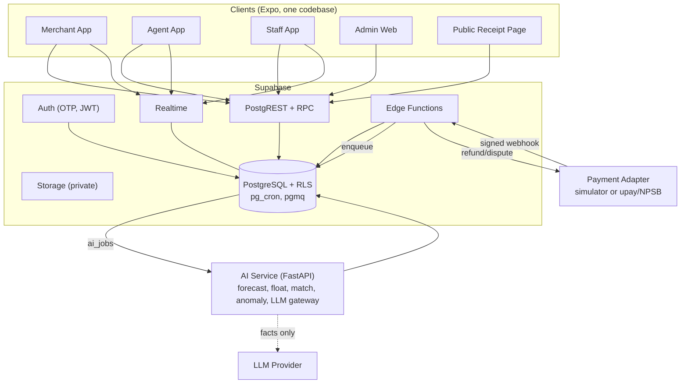
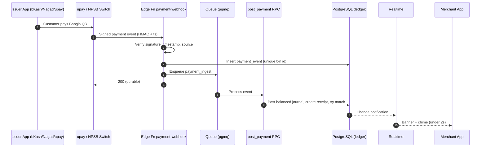

# 05 — System Architecture & Tech Stack

## 1. Architecture principles

1. **One client codebase** (Expo) for Android, iOS, web app, public receipt page and admin web.
2. **Postgres is the source of truth**; the ledger is enforced *inside* the database (constraints + transactional functions), not only in app code.
3. **Event-driven ingestion** of payments; every handler idempotent.
4. **AI is a separate, optional service.** Core flows never wait on it.
5. **Provider adapters**: upay / NPSB integration hidden behind an interface; hackathon uses a simulator with the same contract.
6. **Secure by default**: RLS everywhere, no secrets on the client, least privilege service roles.

## 2. Technology stack

| Layer | Choice | Why |
|---|---|---|
| Mobile + web client | **Expo SDK 56** (React Native 0.85, React 19.2), **TypeScript**, **Expo Router** | One codebase for iOS/Android/web; file-based routing; current stable ([expo.dev/sdk/56](https://expo.dev/sdk/56)) |
| Styling | **NativeWind** (Tailwind for RN) + design tokens | Fast to build, consistent; Expo skill exists |
| State / data | **TanStack Query** (server state, persistence), **Zustand** (UI state) | Caching, retries, offline persistence |
| Forms / validation | **react-hook-form + Zod** (shared schemas in `packages/shared`) | Same validation client & server |
| Local storage / offline | **expo-sqlite** (native) / IndexedDB (web) outbox; **expo-secure-store** for tokens | Offline cash entries, secure token storage |
| Charts | **Victory Native XL** (Skia) on native; Recharts-compatible fallback on web | Smooth band charts |
| i18n | **i18next** + `Intl.NumberFormat('bn-BD')` | Bangla default, lakh grouping |
| Voice | **expo-speech** (TTS); speech-to-text via backend (Whisper-class / cloud STT with Bangla support) | Voice entry & read-out |
| Auth | **Supabase Auth** (phone OTP, JWT, refresh rotation) + app PIN/biometric (expo-local-authentication) | Managed, RLS-integrated |
| Database | **PostgreSQL 16/17** (Supabase) with RLS, `pgcrypto`, `pg_cron`, `pgmq` | Ledger integrity, jobs, queue |
| Server logic | **Postgres functions (RPC)** for money operations; **Supabase Edge Functions (Deno/TS)** for webhooks, receipts, notifications, LLM gateway | Close to data, transactional |
| AI service | **Python 3.12 + FastAPI**, pandas/Polars, **LightGBM** (quantile), scikit-learn (IsolationForest, logistic), statsmodels baselines, MLflow-style registry (files in hackathon) | Mature forecasting stack |
| LLM | Provider-agnostic gateway (Claude / GPT class models) with tool-calling; prompts versioned | Briefing, assistant, report builder, parsing |
| Realtime | Supabase Realtime (Postgres changes on `payment_events` for the business) | Instant "payment received" banner |
| Push | Expo Notifications (FCM/APNs) | Cross-platform push |
| SMS | Bangladeshi SMS gateway via Edge Function (P1) | OTP, critical alerts, receipts |
| Files | Supabase Storage (private buckets, signed URLs ≤ 15 min) | Invoice photos, evidence, exports |
| Observability | Sentry (client+server), OpenTelemetry → Grafana/Loki/Tempo, Postgres logs | Errors, traces, metrics |
| Product analytics | PostHog (self-hostable) with PII scrubbing | Funnels, adoption |
| CI/CD | GitHub Actions, EAS Build / EAS Update, Supabase CLI migrations, Docker for AI service | Repeatable deploys |
| Hosting (hackathon) | Supabase Cloud (Singapore region), AI service on Render/Fly/Railway, web on EAS Hosting or Vercel | Fast |
| Hosting (production) | In-country or upay/UCB-approved data centre / cloud per Bangladesh Bank & PDPO requirements; self-hosted Supabase or managed Postgres; Kubernetes for services | Data residency & regulator expectations |

## 3. Repository layout (monorepo, pnpm + Turborepo)

```text
bizflow/
├── apps/
│   ├── mobile/                 # Expo app (iOS, Android, web incl. /admin and /r/[token])
│   │   ├── app/                # Expo Router routes (see file 04 §2)
│   │   ├── components/
│   │   ├── features/           # books, closing, float, offers, planner, assistant...
│   │   ├── lib/                # supabase client, query client, outbox, i18n, money
│   │   └── locales/bn.json, en.json
│   └── ai-service/             # FastAPI
│       ├── app/api/            # forecast, float, match, anomaly, assistant, briefing, report, parse
│       ├── app/models/         # training & inference code
│       ├── app/llm/            # gateway, prompts/, tools/, guardrails
│       ├── data/synthetic/     # generator + data dictionary
│       └── tests/
├── packages/
│   ├── shared/                 # Zod schemas, types, money utils, enums
│   └── ui/                     # shared RN components & tokens
├── supabase/
│   ├── migrations/             # SQL (tables, RLS, functions, triggers)
│   ├── functions/              # Edge functions: payment-webhook, receipt, notify, llm-proxy, simulator
│   └── seed/                   # demo merchants, agents, 120 days of synthetic data
├── docs/                       # this documentation set
└── .github/workflows/
```

## 4. Component diagram




```text
                ┌──────────────────────── Clients (Expo) ────────────────────────┐
                │ Merchant app │ Agent app │ Staff app │ Admin web │ Receipt page │
                └──────┬──────────────┬──────────────────────┬───────────┬───────┘
                       │ HTTPS (JWT)  │ Realtime (WS)        │           │ public, token
                       ▼              ▼                      ▼           ▼
        ┌─────────────────────── Supabase ──────────────────────────────────────┐
        │ Auth (OTP, JWT) │ PostgREST + RPC │ Realtime │ Storage │ Edge Funcs   │
        │                                                                        │
        │ PostgreSQL: businesses · memberships · payment_events · ledger ·       │
        │   journal · receipts · closings · suppliers · offers · disputes ·      │
        │   ai_outputs · audit_events   (RLS on all)                             │
        │ pg_cron: nightly forecast trigger, overdue marking, retention          │
        │ pgmq: payment_ingest, ai_jobs, notifications                           │
        └───────┬──────────────────────────────────────┬────────────────────────┘
                │ webhook (signed)                      │ service-to-service (mTLS / signed JWT)
                ▼                                       ▼
   ┌──────────────────────────┐            ┌──────────────────────────────┐
   │ Payment Adapter          │            │ AI Service (FastAPI)         │
   │  • Simulator (hackathon) │            │  forecast · float · match ·  │
   │  • upay acquiring API    │            │  anomaly · offer advisor ·   │
   │  • NPSB / TSI status     │            │  LLM gateway (briefing,      │
   └──────────────────────────┘            │  assistant, report, parse)   │
                                           └──────────────┬───────────────┘
                                                          ▼
                                              LLM provider (no raw PII)
```

## 5. Payment ingestion flow



```text
1. Issuer app pays upay-acquired Bangla QR → upay switch → BizFlow webhook (Edge Function `payment-webhook`)
2. Verify HMAC signature + timestamp (±5 min) + source allow-list
3. INSERT payment_events (provider, provider_txn_id UNIQUE, raw hash, payload_minimized) ON CONFLICT DO NOTHING
4. Enqueue pgmq 'payment_ingest' → worker calls RPC post_payment(event_id)
5. post_payment (single DB transaction):
     - resolve business by merchant/agent account id
     - create transaction record (type, amount_minor, status)
     - post balanced journal entry (debit wallet/e-float, credit sales / customer liability by type)
     - create receipt (token), apply offer/stamp rules (if opted in)
     - try exact match (reference) → else mark 'needs_match'
6. Realtime broadcasts to the business channel → banner + sound
7. Async: ai_jobs (match suggestion, anomaly score) → ai_outputs
8. Reconciliation job compares provider settlement reports / TSI status vs ledger (hourly + end-of-day)
```

Idempotency: `provider_txn_id` unique; all RPCs accept `idempotency_key`; client-generated UUIDs for manual entries.

## 6. Offline-first design (cash entries)

- Client writes manual entries (cash sale, expense, baki, manual wallet entry, closing draft) to a local **outbox** table with `client_uuid`, `created_at_device`.
- Sync worker sends in order with exponential backoff; server RPC is idempotent on `client_uuid`.
- Ledger is append-only → no merge conflicts; only "closing" needs server validation (if new events arrived, the closing is recomputed and the user confirms).
- Read cache: TanStack Query persisted to storage for last 7 days.
- UI: `OfflineBanner` with pending count; verified upay payments clearly shown as "server-confirmed" only.

## 7. AI service integration

| Call | Trigger | Mode | Timeout | Fallback |
|---|---|---|---|---|
| Forecast (7-day) | nightly `pg_cron`, after closing, manual refresh | async job → `forecast_runs` | 30 s | seasonal naive baseline in SQL |
| Float forecast (24 h hourly) | hourly during open hours | async | 15 s | same-hour last-4-weeks median |
| Match suggestion | on `needs_match` | async | 5 s | exact-match only |
| Anomaly score | on ingest batch / hourly | async | 10 s | rules only (duplicate, large amount) |
| Briefing | 8 am + after closing | async | 20 s | template text from facts JSON |
| Assistant | user message | sync stream | 25 s | "AI unavailable" + quick links |
| Voice/text parse | user entry | sync | 6 s | manual form |
| Report builder | user request | sync | 15 s | report list |
| Offer advisor | on offer create / weekly | async | 10 s | hide suggestion |

All AI outputs stored in `ai_outputs` with model version, input hash, latency, confidence, and user feedback → reproducible & auditable.

## 8. Environments

| Env | Purpose | Data |
|---|---|---|
| local | dev with `supabase start`, simulator | synthetic |
| staging | demo/judging, pilot rehearsal | synthetic |
| pilot | limited real merchants (after approval) | real, in approved region |
| production | national | real |

Feature flags (DB table + client cache): `ai.forecast`, `ai.assistant`, `ai.float`, `offers`, `refunds`, `sms`, `voice`, per business or global.

## 9. Scaling to national level

### 9.1 Load estimate
| Assumption | Value |
|---|---|
| Active BizFlow businesses | 1,000,000 |
| Avg events/day per business (payments + manual + agent txns) | 60 |
| Events/day | 60 M |
| Average rate | ≈ 700 events/s |
| Peak (Eid, evenings, ×5) | ≈ 3,500 events/s |
| Journal lines/day (2–3 per event) | ≈ 150 M |

### 9.2 Plan
| Stage | Businesses | Data tier |
|---|---|---|
| Hackathon/pilot | ≤ 1k | Single Supabase Postgres |
| City | ≤ 50k | Bigger instance, read replica for reports/AI, monthly partitions on journal & events |
| National | ≤ 1M+ | Partition by month + hash(business_id); Citus/horizontal sharding by `business_id`; separate OLAP store (ClickHouse/BigQuery-class in approved region) for analytics & AI training; Kafka/Redpanda for ingestion if pgmq saturates |

Other scaling levers: PgBouncer pooling, stateless Edge/AI services autoscaled, receipts served from CDN-cached static page with token lookup, cold storage for > 13-month events (retention policy), per-business rate limits.

### 9.3 Availability targets (production)
| Service | Target |
|---|---|
| Payment ingestion + ledger | 99.95%, RPO ≤ 1 min, RTO ≤ 30 min |
| App read APIs | 99.9% |
| AI services | 99.0% (non-critical, fallback) |

## 10. Integration points with upay (production)

| Need | Integration |
|---|---|
| Payment events | upay acquiring webhook / event stream (Bangla QR via NPSB) |
| Transaction status | Transaction Status Inquiry (TSI) per BB 2026 guideline |
| Settlement reports | Daily file/API → reconciliation job |
| Agent transactions | upay agent platform event feed (cash-in/out, send money, commission) |
| Refund initiation | upay merchant refund API (BizFlow requests; upay executes) |
| Disputes | upay dispute system ↔ NPSB DMS; BizFlow shows status & evidence |
| KYC / identity | upay merchant/agent registry (read-only) |
| SSO for admin | upay corporate IdP |

## 11. Cost sketch (pilot scale, monthly, indicative)

| Item | Estimate |
|---|---|
| Supabase Pro + compute add-on | USD 25–150 |
| AI service container | USD 20–60 |
| LLM usage (briefing 2/day + 5 assistant msgs/day × 150 users, small model) | USD 30–120 |
| SMS (OTP + critical alerts) | per local tariff |
| Sentry/PostHog | free tiers / self-host |

Cost controls: cache briefings, small model for parsing, prompt caching, per-business daily LLM budget, aggregate facts before calling LLM.

---

## 12. Update: October 2026 UI redesign (client architecture)

- **Pluggable data source.** `apps/mobile/lib/supabase.ts` exports either the real
  Supabase client or `lib/demo/client.ts`, a stand-in with the same surface the app uses
  (`auth`, `rpc`, `from(table)` reads, `functions.invoke`). It is chosen by
  `EXPO_PUBLIC_DATA_SOURCE=demo`, or automatically when no Supabase URL is configured. The
  demo serves an in-memory, append-only, double-entry ledger (`lib/demo/ledger.ts`) seeded
  with 21 days of merchant and agent data, returns the same shapes and `CODE: message`
  errors as the RPCs, and persists to device storage. Screens do not know which source they
  use, so backend work replaces nothing on the client.
- **Run modes.** `pnpm --filter mobile web:demo` (port 8082, sample data, no Docker) and
  `pnpm --filter mobile dev` (port 8081, live local Supabase).
- **Client modules added.** `components/kit.tsx` (UI kit), `components/motion.tsx`
  (animated money, success sheet), `components/auth.tsx` and `lib/pin.ts` (PIN),
  `lib/feedback.ts` (haptics, sound, reduced motion), `lib/view.ts` (transaction
  presentation helpers).
- **Never in production.** The demo source must be disabled in production builds by
  setting the Supabase URL and leaving `EXPO_PUBLIC_DATA_SOURCE` unset (docs/09).
