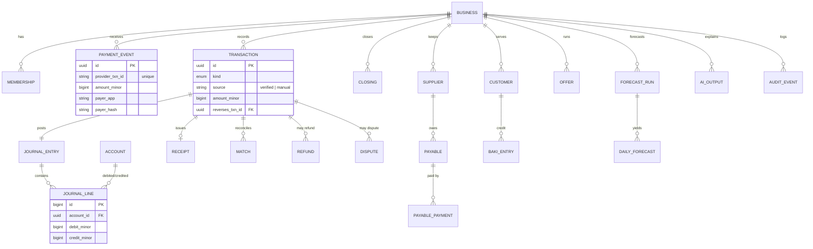
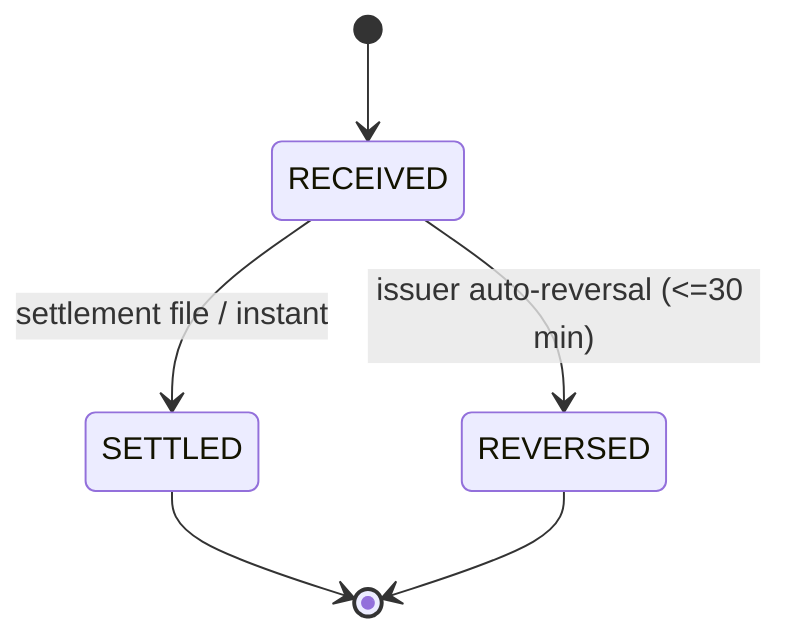
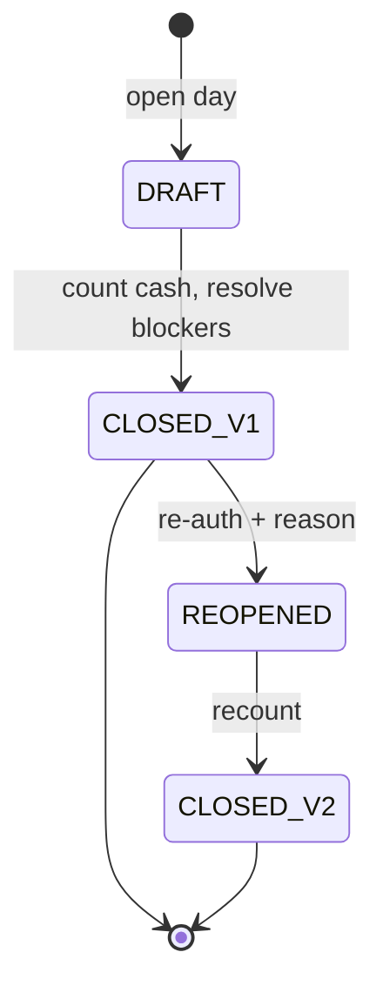
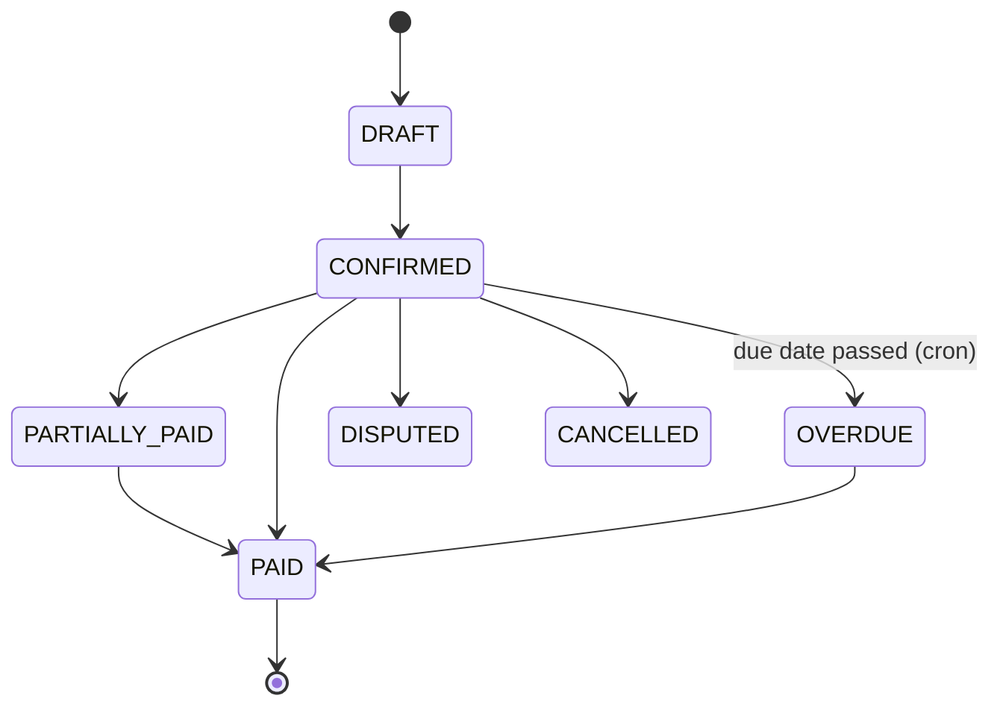
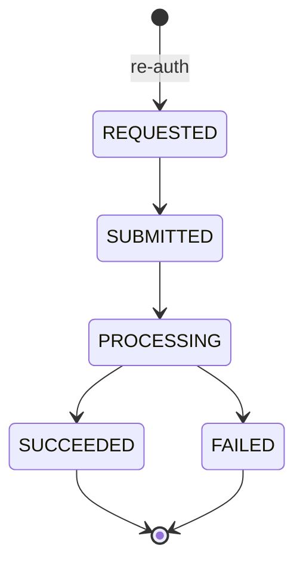

# 06 — Data Model & Ledger

## 1. Conventions

- All money stored as **`bigint` minor units (poisha)**; Tk 1 = 100. Never floats.
- Currency fixed `BDT` (column kept for future).
- IDs: `uuid` (v7 preferred for time ordering). Human references: `UPY-xxxx`, `D-1042`.
- Every business-scoped table has `business_id uuid not null` + RLS.
- Timestamps `timestamptz`; server time authoritative; `device_time` stored separately for offline entries.
- Financial tables are **append-only** (no UPDATE/DELETE grants; triggers reject them). Status changes are new rows in `*_status_history` or event tables.

## 2. Entity overview

### Core schema (entity-relationship)




```text
users ─< memberships >─ businesses ─< outlets
                           │
     ┌──────────┬──────────┼───────────┬────────────┬────────────┬───────────┐
payment_events  transactions  journal_entries─< journal_lines   receipts   closings
     │              │                                              │
     └──> matches  refunds / disputes        suppliers ─< payables ─< payable_payments
customers(baki) ─< baki_entries     offers ─< offer_redemptions / stamp_cards
ai_outputs  forecast_runs ─< daily_forecasts   float_forecasts   audit_events  access_log
feature_flags  consents  notifications  exports
```

## 3. Core DDL (abridged, PostgreSQL)

```sql
-- Tenancy -------------------------------------------------------------
create type business_type as enum ('MERCHANT','AGENT');
create type member_role   as enum ('merchant_owner','agent_owner','staff','manager','auditor');

create table businesses (
  id uuid primary key default gen_random_uuid(),
  type business_type not null,
  name text not null,
  category text not null,               -- grocery, pharmacy, ..., agent
  location_type text,                   -- campus, market, residential, highway
  upay_account_ref text unique,         -- merchant/agent account at upay (tokenized)
  verified boolean not null default false,
  status text not null default 'active' check (status in ('active','restricted','closed')),
  opening_hours jsonb, closed_weekday smallint,
  settings jsonb not null default '{}', -- tolerance, reserve, staff limits
  created_at timestamptz not null default now()
);

create table memberships (
  user_id uuid references auth.users(id),
  business_id uuid references businesses(id),
  role member_role not null,
  permissions jsonb not null default '{}',   -- staff toggles
  status text not null default 'active',
  primary key (user_id, business_id)
);

-- Payments & transactions ---------------------------------------------
create table payment_events (            -- raw-ish inbound events (minimized)
  id uuid primary key default gen_random_uuid(),
  business_id uuid not null references businesses(id),
  provider text not null,                -- 'upay_sim','upay','npsb'
  provider_txn_id text not null,
  event_type text not null,              -- payment.succeeded, payment.reversed, agent.cash_in ...
  amount_minor bigint not null check (amount_minor > 0),
  payer_app text,                        -- bKash, Nagad, upay... (no payer identity)
  payer_hash text,                       -- salted hash for repeat-customer (consent-gated use)
  reference text,
  occurred_at timestamptz not null,
  received_at timestamptz not null default now(),
  payload_hash text not null,
  unique (provider, provider_txn_id, event_type)
);

create type txn_kind as enum (
  'QR_PAYMENT','CASH_SALE','BAKI_SALE','BAKI_COLLECTION','EXPENSE',
  'SUPPLIER_PAYMENT','REFUND','OWNER_WITHDRAWAL','OWNER_DEPOSIT',
  'AGENT_CASH_IN','AGENT_CASH_OUT','AGENT_SEND_MONEY','AGENT_COMMISSION',
  'MANUAL_WALLET','CLOSING_VARIANCE','REVERSAL');

create table transactions (
  id uuid primary key default gen_random_uuid(),
  business_id uuid not null references businesses(id),
  kind txn_kind not null,
  source text not null check (source in ('verified','manual')),
  wallet text,                           -- 'upay','bkash','nagad','rocket','cash'
  amount_minor bigint not null check (amount_minor > 0),
  payment_event_id uuid references payment_events(id),
  category text, note text, reference text,
  customer_id uuid,                      -- baki / loyalty (optional)
  actor_user_id uuid not null,
  client_uuid uuid,                      -- offline idempotency
  reverses_txn_id uuid references transactions(id),
  occurred_at timestamptz not null, device_time timestamptz,
  created_at timestamptz not null default now(),
  unique (business_id, client_uuid)
);

-- Double-entry ledger ---------------------------------------------------
create table accounts (
  id uuid primary key default gen_random_uuid(),
  business_id uuid not null references businesses(id),
  code text not null, name text not null,
  type text not null check (type in ('asset','liability','equity','income','expense')),
  unique (business_id, code)
);

create table journal_entries (
  id uuid primary key default gen_random_uuid(),
  business_id uuid not null,
  transaction_id uuid not null references transactions(id),
  posted_at timestamptz not null default now(),
  memo text
);

create table journal_lines (
  id bigserial primary key,
  entry_id uuid not null references journal_entries(id),
  business_id uuid not null,
  account_id uuid not null references accounts(id),
  debit_minor bigint not null default 0 check (debit_minor >= 0),
  credit_minor bigint not null default 0 check (credit_minor >= 0),
  check ((debit_minor = 0) <> (credit_minor = 0))
);
-- Balanced-entry guarantee: deferred constraint trigger checks
-- sum(debit) = sum(credit) per entry_id at COMMIT; otherwise raise.
```

Other tables (columns abbreviated):

| Table | Key columns |
|---|---|
| `receipts` | id, business_id, transaction_id, token (≥ 128-bit random, unique), status, offer_snapshot jsonb, created_at |
| `matches` | id, business_id, transaction_id, target_type (invoice/order/baki), target_id, method (exact/ai_suggested/manual), score, decided_by, decision, decided_at |
| `closings` | id, business_id, scope (business/shift), staff_user_id, period_start, period_end, version, expected_cash_minor, counted_cash_minor, variance_minor, totals jsonb, exceptions jsonb, closed_by, closed_at, reopened_from uuid, reason |
| `float_snapshots` | business_id, wallet, balance_minor, source (verified/manual/count), at |
| `customers` | id, business_id, display_name, phone_enc, phone_hash, consent_marketing bool, consent_at |
| `baki_entries` | id, business_id, customer_id, transaction_id, direction (gave/received), amount_minor |
| `suppliers` | id, business_id, name, phone_enc, cycle, active |
| `payables` | id, business_id, supplier_id, invoice_ref, amount_minor, due_date, status, doc_path |
| `payable_payments` | id, payable_id, transaction_id, amount_minor |
| `refunds` | id, business_id, original_txn_id, amount_minor, reason, status, provider_ref, requested_by |
| `disputes` | id, case_no, business_id, original_txn_id, amount_minor, reason, opened_by (customer/merchant/support), status, deadline_at, owner_user_id, resolution, evidence jsonb |
| `offers` | id, business_id, type, params jsonb, budget_minor, spent_minor, starts_at, ends_at, audience, status |
| `offer_redemptions` | id, offer_id, transaction_id, customer_ref, discount_minor |
| `stamp_cards` | id, offer_id, customer_ref, stamps, completed_at |
| `forecast_runs` | id, business_id, kind (sales7d/float24h), model_version, feature_version, data_cutoff, generated_at, status, confidence, metrics jsonb |
| `daily_forecasts` | run_id, date, p10_minor, p50_minor, p90_minor, digital_p50_minor, cash_p50_minor |
| `hourly_float_forecasts` | run_id, hour_start, cash_demand_p50/p90, efloat_demand_p50/p90 |
| `ai_outputs` | id, business_id, feature, model_version, prompt_version, input_hash, output jsonb, confidence, latency_ms, status, feedback, created_at |
| `audit_events` | id bigserial, business_id, actor, action, object_type, object_id, before_hash, after jsonb, ip, device_id, prev_hash, hash |
| `access_log` | id, staff_user (upay), business_id, case_id, reason, scope, granted_at, expires_at |
| `consents` | user/customer, purpose, granted, version, at |
| `exports` | id, business_id, report, filters, requested_by, file_path, expires_at |
| `feature_flags` | key, scope (global/business), business_id, enabled, updated_by |

## 4. Chart of accounts (auto-created per business)

| Code | Merchant | Agent | Type |
|---|---|---|---|
| 1000 | Cash drawer | Cash drawer | asset |
| 1010 | upay merchant wallet | upay e-float | asset |
| 1020 | Pending settlement | — | asset |
| 1030 | Other wallets (manual) | Other e-floats (manual, sub-ledger per wallet) | asset |
| 1100 | Baki receivable | Baki receivable | asset |
| 2000 | Supplier payable | — | liability |
| 2100 | Refund/dispute hold | Dispute hold | liability |
| 3000 | Owner equity / drawings | Owner equity / drawings | equity |
| 4000 | Sales | — | income |
| 4010 | Sales returns & discounts (contra) | — | income (contra) |
| 4200 | — | Commission income | income |
| 5000 | Supplier purchases | — | expense |
| 5100 | Operating expenses (rent, utilities, transport, salary, other) | Operating expenses | expense |
| 9000 | Cash over/short | Cash over/short | expense |

## 5. Posting rules

| Event | Debit | Credit |
|---|---|---|
| QR payment (instant settled) | 1010 upay wallet | 4000 Sales |
| QR payment (pending settlement) | 1020 Pending | 4000 Sales |
| Settlement arrives | 1010 | 1020 |
| Cash sale | 1000 Cash | 4000 Sales |
| Baki sale | 1100 Baki | 4000 Sales |
| Baki collected (cash/QR) | 1000 / 1010 | 1100 Baki |
| Expense paid cash/wallet | 5100 Expense | 1000 / 1010 |
| Supplier invoice confirmed | 5000 Purchases | 2000 Payable |
| Supplier paid | 2000 Payable | 1000 / 1010 |
| Refund to customer | 4010 Returns | 1010 |
| Discount (offer) on sale | 4010 Returns & discounts | 4000 (gross-up) — or record net sale + discount memo |
| Owner withdrawal | 3000 Drawings | 1000 / 1010 |
| Closing shortage | 9000 Over/short | 1000 Cash |
| Closing excess | 1000 Cash | 9000 Over/short |
| **Agent cash-in** (customer gives cash, agent sends e-money) | 1000 Cash | 1010 e-float |
| **Agent cash-out** (agent receives e-money, gives cash) | 1010 e-float | 1000 Cash |
| Agent send money on customer's behalf (paid in cash) | 1000 Cash | 1010 e-float |
| Agent commission credited | 1010 e-float | 4200 Commission |
| Manual other-wallet cash-out (agent) | 1030 (wallet X) | 1000 Cash |
| Manual other-wallet cash-in (agent, proposed) | 1000 Cash | 1030 (wallet X) |
| Reversal of any entry | mirror lines of original | |

Correction = `REVERSAL` transaction (mirror) + new correct transaction; both linked; audit event with reason.

## 6. Derived balances (views, never stored as truth)

```sql
create view v_account_balances as
select l.business_id, a.code, a.name,
       sum(l.debit_minor) - sum(l.credit_minor) as balance_minor
from journal_lines l join accounts a on a.id = l.account_id
group by 1,2,3;
```
Materialized daily snapshots (`balance_snapshots`) for speed; always reproducible from journal.

**Expected cash (closing)** = opening counted cash + Σ cash debits − Σ cash credits within period (account 1000).

## 7. State machines

### Payment and settlement



### Daily closing (versioned, append-only)



### Payable lifecycle



### Refund lifecycle




```text
Payment:   RECEIVED → (REVERSED) ; settlement: PENDING → SETTLED
Match:     UNMATCHED → SUGGESTED → MATCHED | REJECTED → (MANUAL_MATCHED | DEFERRED)
Closing:   DRAFT → CLOSED(v1) → REOPENED → CLOSED(v2) ...
Payable:   DRAFT → CONFIRMED → PARTIALLY_PAID → PAID ; CONFIRMED → OVERDUE (cron) ; → DISPUTED | CANCELLED
Refund:    REQUESTED → SUBMITTED → PROCESSING → SUCCEEDED | FAILED
Dispute:   OPEN → AWAITING_MERCHANT → UNDER_REVIEW → RESOLVED_CUSTOMER | RESOLVED_MERCHANT | ESCALATED(NPSB DMS) → CLOSED
Offer:     DRAFT → ACTIVE → PAUSED(budget|owner) → ENDED
Forecast:  QUEUED → RUNNING → READY | ABSTAINED | FAILED
```

Transitions enforced by RPC functions with `WHERE status = :expected` (optimistic concurrency) and history rows.

## 8. Critical integrity rules (DB-enforced)

1. Journal entry balanced (deferred constraint trigger).
2. No UPDATE/DELETE on `transactions`, `journal_*`, `closings`, `audit_events`, `payment_events` (revoked privileges + trigger).
3. `refunds`: Σ succeeded+in-flight refunds ≤ original amount — enforced in `request_refund()` with `SELECT ... FOR UPDATE` on original transaction.
4. Unique `provider_txn_id` per provider/event type (idempotent ingestion).
5. Unique `(business_id, client_uuid)` (idempotent offline sync).
6. Offer `spent_minor ≤ budget_minor` (check + row lock).
7. Closing period non-overlapping per scope (exclusion constraint on `tstzrange`).
8. Audit hash chain: `hash = sha256(prev_hash || canonical_json(row))`; nightly verifier job.

## 9. Row Level Security examples

```sql
alter table transactions enable row level security;

create function is_member(b uuid) returns boolean language sql stable security definer as $$
  select exists (select 1 from memberships
                 where user_id = auth.uid() and business_id = b and status = 'active');
$$;

create function has_role(b uuid, roles member_role[]) returns boolean language sql stable security definer as $$
  select exists (select 1 from memberships
                 where user_id = auth.uid() and business_id = b
                   and status = 'active' and role = any(roles));
$$;

-- Owners see everything in their business; staff only their own rows
create policy txn_owner_read on transactions for select
  using (has_role(business_id, array['merchant_owner','agent_owner','manager']::member_role[]));

create policy txn_staff_read on transactions for select
  using (has_role(business_id, array['staff']::member_role[]) and actor_user_id = auth.uid());

-- No direct inserts: writes only through SECURITY DEFINER RPCs that validate role & post the journal
revoke insert, update, delete on transactions from authenticated;
```

upay staff never get table access through RLS; they use admin RPCs that require an active `access_log` grant (case-scoped, time-limited) and return masked columns.

## 10. Data retention (proposal, confirm with Legal)

| Data | Retention |
|---|---|
| Ledger, transactions, closings, receipts | ≥ 5 years (financial records; confirm with BB/upay policy) |
| Raw payment payload | Hash + minimized fields only; raw kept by upay core, not BizFlow |
| Customer phone (baki/loyalty) | Until consent withdrawn or 24 months inactivity |
| AI outputs | 13 months (model evaluation), then aggregated |
| LLM conversation logs | 30 days, PII-redacted |
| Audit & access logs | ≥ 5 years |
| Exports | File deleted after 24 h; record kept |

## 11. Synthetic data for the hackathon

Generator (`apps/ai-service/data/synthetic/generate.py`) produces 180 days for 12 merchants + 6 agents:

| Profile | Patterns injected |
|---|---|
| Campus grocery | weekday peaks, exam weeks, closed Friday morning, semester break dip |
| Neighbourhood grocery | month-start salary bump, Friday evening peak, Eid spike |
| Pharmacy | stable, small weekend effect, occasional bulk orders |
| Restaurant/tea shop | lunch & evening peaks, Ramadan iftar shift |
| Stationery | exam-season spike |
| Online seller | campaign spikes, higher refunds |
| Agent (urban) | salary-day cash-out surge (1st–7th), remittance-day cash-out, Eid cash-out spike, evening rush |
| Agent (semi-urban) | market-day (haat) pattern, harvest season |

Also injected: duplicates, missing references, amount mismatches, a refund spike, unusual late-night activity, unclosed days, cash variances — so every AI feature has something real to find. A `DATA_DICTIONARY.md` documents every field and assumption.

---

## 12. Update: October 2026 UI redesign (data implications)

- **Manual wallet direction (proposed).** The UI records both directions of an
  other-wallet transaction. The cash-in posting rule above needs `post_manual_wallet` to
  accept `p_direction` ('cash_out' default, 'cash_in'); the `category` column can carry the
  direction for display until a dedicated column exists.
- **No new tables for the PIN.** The device PIN is stored only on the device (docs/09).
- **Notifications.** There is no notifications table yet; the app derives them from
  `today_insights`. A `notifications` table (business_id, kind, severity, payload,
  read_at) is the suggested next step (docs/16 section 7).
- **Demo ledger.** `apps/mobile/lib/demo/ledger.ts` mirrors the account codes and posting
  rules here for the no-backend demo; it is test data only, never a source of truth.
