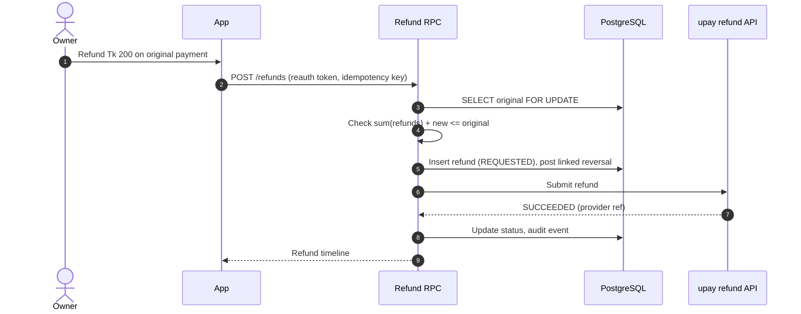

# 07 — API Specification

## 1. Conventions

| Item | Rule |
|---|---|
| Base (app API) | `https://<project>.supabase.co/rest/v1/rpc/<function>` (Postgres RPC) and `/functions/v1/<edge-fn>`; documented below as logical REST paths `/api/v1/...` |
| Base (AI service) | `https://ai.<domain>/v1/...` — called **only server-to-server** (Edge Functions / DB jobs), never from the app directly |
| Auth | `Authorization: Bearer <Supabase JWT>`; claims: `sub`, `active_business_id`, `role` |
| Business scope | Derived from JWT + membership; any `business_id` in a body is re-checked server-side |
| Idempotency | All POST that create money/records require `Idempotency-Key: <uuid>`; same key + same body → same response for 24 h; same key + different body → `409` |
| Money | `amount_minor` integer (poisha). Responses also include `amount_display` (e.g. "Tk 12,300") |
| Time | ISO-8601 with offset; business timezone `Asia/Dhaka` |
| Pagination | Cursor: `?limit=50&cursor=<opaque>` |
| Versioning | `/v1`; breaking changes → `/v2` |
| Rate limits | Per user: 60 req/min default; OTP: 5/hour/phone; assistant: 30 msg/hour; receipt page: 30/min/IP |
| Errors | RFC 9457 problem+json |

```json
{
  "type": "https://bizflow.app/errors/refund-exceeds-remaining",
  "title": "Refund exceeds refundable amount",
  "status": 422,
  "code": "REFUND_EXCEEDS_REMAINING",
  "detail": "Refundable remaining is 65000 poisha.",
  "message_bn": "<localized Bangla string, e.g. max refundable Tk 650>",
  "trace_id": "01J..."
}
```

## 2. Auth & session

| Method | Path | Purpose |
|---|---|---|
| POST | `/auth/v1/otp` | Send OTP (Supabase) |
| POST | `/auth/v1/verify` | Verify OTP → tokens |
| GET | `/api/v1/me` | User, memberships, active business, permissions, feature flags |
| POST | `/api/v1/me/active-business` | Switch Shop ⇄ Agent (re-issues claims) |
| POST | `/api/v1/me/reauth` | Verify PIN/biometric assertion → short-lived `reauth_token` (5 min) for sensitive calls |
| GET/DELETE | `/api/v1/me/devices[/{id}]` | List / revoke devices |

## 3. Business & onboarding

| Method | Path | Notes |
|---|---|---|
| POST | `/api/v1/businesses` | Create MERCHANT/AGENT with opening balances (creates chart of accounts) |
| GET/PATCH | `/api/v1/businesses/current` | Profile & settings (tolerance, reserve, closing time) |
| GET | `/api/v1/businesses/current/qr` | Static QR payload + image; `?amount_minor=&reference=` for dynamic |
| POST | `/api/v1/staff` | Invite staff (owner, reauth) |
| PATCH/DELETE | `/api/v1/staff/{user_id}` | Permissions / revoke |

## 4. Transactions & books

| Method | Path | Notes |
|---|---|---|
| GET | `/api/v1/transactions` | Filters: `from,to,kind,source,wallet,status,match_status,staff,q` |
| GET | `/api/v1/transactions/{id}` | Detail incl. statuses, journal lines (owner), receipt, matches |
| POST | `/api/v1/transactions/cash-sale` | `{amount_minor, category?, note?, customer_id?, client_uuid, device_time}` |
| POST | `/api/v1/transactions/expense` | `{amount_minor, expense_type, paid_from, note?, doc_path?, client_uuid}` |
| POST | `/api/v1/transactions/manual-wallet` | `{wallet, kind, amount_minor, direction?, note?, client_uuid}` (source = manual; `direction` = `cash_out` default or `cash_in`, sent as `p_direction` only for cash-in; backend support pending, docs/16 section 7) |
| POST | `/api/v1/transactions/{id}/correct` | `{reason, replacement?}` → reversal + replacement (reauth) |
| POST | `/api/v1/transactions/withdrawal` | Owner records withdrawal (record only; no fund movement) |
| POST | `/api/v1/sync/outbox` | Batch of offline entries `[{client_uuid, type, payload}]` → per-item result |

## 5. Baki

| Method | Path |
|---|---|
| GET/POST | `/api/v1/customers` |
| POST | `/api/v1/customers/{id}/baki` `{direction: gave|received, amount_minor, wallet}` |
| GET | `/api/v1/customers/{id}/statement` |
| POST | `/api/v1/customers/{id}/reminder-draft` → returns Bangla text + pay link (not sent) |

## 6. Suppliers & payables

| Method | Path |
|---|---|
| GET/POST/PATCH | `/api/v1/suppliers[/{id}]` |
| GET/POST | `/api/v1/payables` (`status`, `due_before`) |
| POST | `/api/v1/payables/{id}/confirm` |
| POST | `/api/v1/payables/{id}/payments` `{amount_minor, paid_from, client_uuid}` |
| POST | `/api/v1/payables/{id}/cancel` `{reason}` |

## 7. Reconciliation & closing

| Method | Path | Notes |
|---|---|---|
| GET | `/api/v1/review-queue` | Items with reason codes and AI suggestions |
| POST | `/api/v1/matches/{suggestion_id}/accept` / `reject` | Audit logged |
| POST | `/api/v1/matches/manual` | `{transaction_id, target_type, target_id}` |
| GET | `/api/v1/closings/preview?scope=business|shift` | Expected totals, blockers |
| POST | `/api/v1/closings` | `{scope, counted_cash_minor, counted_floats?, note, exception_reason?}` |
| POST | `/api/v1/closings/{id}/reopen` | `{reason}` + reauth → new version |
| GET | `/api/v1/closings/{id}/receipt` | Versioned PDF/JSON |

## 8. Agent float

| Method | Path |
|---|---|
| GET | `/api/v1/float` → per-wallet balances (verified/manual), drawer expected |
| POST | `/api/v1/float/count` `{cash_minor, wallets:[{wallet, balance_minor}]}` |
| GET | `/api/v1/float/forecast` → latest hourly forecast + advice |
| GET | `/api/v1/float/commission?from&to` |

## 9. Planner & forecast

| Method | Path | Notes |
|---|---|---|
| GET | `/api/v1/forecasts/latest?kind=sales7d` | p10/p50/p90 per day, confidence, drivers, data cutoff, model version, or `abstained` with reason |
| POST | `/api/v1/forecasts/refresh` | Enqueue (rate-limited 3/day) |
| GET | `/api/v1/planner/safe-to-withdraw` | Deterministic breakdown (every term shown) |
| POST | `/api/v1/planner/simulate` | `{withdraw_minor?, sales_adjust_pct?, move_payable:{id,new_date}?, reserve_minor?, refund_minor?}` → daily projected balance band, shortage days, suggestion. Uses stored forecast; no model call. |
| POST | `/api/v1/forecasts/{date}/feedback` | `{tag: closed_early|weather|bulk_order|data_missing|other, note}` |

Example `safe-to-withdraw` response:
```json
{
  "as_of": "2026-10-02T21:31:00+06:00",
  "current_cleared_minor": 3000000,
  "forecast_inflow_p10_7d_minor": 8200000,
  "confirmed_expenses_7d_minor": 3700000,
  "supplier_dues_7d_minor": 4500000,
  "dispute_refund_hold_minor": 50000,
  "lowest_projected_day": "2026-10-04",
  "lowest_projected_balance_p10_minor": 1950000,
  "reserve_minor": 1200000,
  "uncertainty_buffer_minor": 150000,
  "safe_to_withdraw_minor": 600000,
  "shortfall_minor": 0,
  "confidence": "medium",
  "explanation_bn": "<localized Bangla string: after paying the supplier Tk 45,000 on Saturday the balance is lowest (~Tk 19,500); keeping a Tk 12,000 reserve and Tk 1,500 buffer, up to Tk 6,000 is safe to withdraw today>"
}
```
The algorithm (lowest projected day, buffer rules) is defined in `08-ai-ml-specification.md` §6.

## 10. Offers

| Method | Path |
|---|---|
| GET/POST | `/api/v1/offers` (POST: `{type, params, budget_minor, starts_at, ends_at, audience}`) |
| POST | `/api/v1/offers/{id}/publish` / `pause` / `end` |
| GET | `/api/v1/offers/{id}/results` → redemptions, cost, incremental estimate with interval & method |
| GET | `/api/v1/offers/suggestions` → AI advisor output |

## 11. Refunds & disputes

### Refund request (sequence, concurrency-safe)




| Method | Path | Notes |
|---|---|---|
| POST | `/api/v1/refunds` | `{original_txn_id, amount_minor, reason}` + `X-Reauth-Token`; checks remaining refundable under row lock |
| GET | `/api/v1/refunds/{id}` | Status timeline |
| GET/POST | `/api/v1/disputes` | Merchant can open; customer opens via receipt |
| POST | `/api/v1/disputes/{id}/evidence` | Signed upload URL |
| POST | `/api/v1/disputes/{id}/respond` | Merchant statement |

## 12. Reports & AI

| Method | Path | Notes |
|---|---|---|
| RPC | `report_rows(business_id, report_key, from, to)` | Owner only; role-scoped rows and every financial amount come from the ledger |
| RPC | `log_export(business_id, report_key, filters, format, row_count, file_name)` | Re-auth required; creates the `exports` row and audit event before the client shares the local CSV |
| POST | `/api/v1/ai/assistant` | `{message, conversation_id?}` → SSE stream; tool calls server-side; returns `citations[]` |
| POST | `/api/v1/ai/parse-entry` | `{text|audio_path}` → draft entry `{kind, amount_minor, category, confidence}` (not saved) |
| POST | `/api/v1/ai/report-builder` | `{request_text}` → `{report_key, filters}` intent only; preview rows always come from `report_rows` |
| GET | `/api/v1/ai/briefing/latest` | Today's briefing with facts & version |
| POST | `/api/v1/ai/outputs/{id}/feedback` | yes/no + reason |
| GET | `/api/v1/health/kpis` | KPI values, formulas, status, AI explanation |

## 13. Public receipt

| Method | Path | Notes |
|---|---|---|
| GET | `/r/{token}` | HTML page; `Cache-Control: private, max-age=60`; `X-Robots-Tag: noindex`. Served by the `receipt` Edge Function, reachable directly as `/functions/v1/receipt?token={token}`; the short `/r/{token}` form is a host rewrite onto it. |
| POST | `/r/{token}/problem` | `{reason, contact?}` → dispute request; captcha + rate limit |
| POST | `/r/{token}/loyalty-optin` | Explicit consent for stamps/offers (phone OTP light) |

## 14. Inbound webhook (payment provider → BizFlow)

```http
POST /functions/v1/payment-webhook
X-Provider: upay
X-Signature: t=1759420920,v1=hex(hmac_sha256(secret, t + "." + body))
Content-Type: application/json

{
  "event_id": "evt_01J9...",
  "event_type": "payment.succeeded",
  "provider_txn_id": "UPY8X2K4",
  "account_ref": "M-000123",
  "amount_minor": 85000,
  "currency": "BDT",
  "payer_app": "bKash",
  "payer_token": "opaque-per-merchant-token",
  "reference": "INV-1048",
  "occurred_at": "2026-10-02T10:42:11+06:00",
  "settlement": {"status": "settled", "settled_at": "2026-10-02T10:42:12+06:00"}
}
```

Rules: reject if signature invalid or `|now − t| > 300 s`; respond `200` within 2 s after durable insert (processing async); duplicates → `200 {"duplicate": true}`; unknown `account_ref` → quarantine table + alert. Event types: `payment.succeeded`, `payment.reversed`, `settlement.completed`, `refund.succeeded`, `refund.failed`, `dispute.opened`, `dispute.updated`, `agent.cash_in`, `agent.cash_out`, `agent.send_money`, `agent.commission`.

Hackathon: `POST /functions/v1/simulator-pay` (demo only) generates a signed event and sends it
through the same webhook path, so a demo exercises the real signature check and the real posting
rules. It refuses unless the function environment has `DEMO_MODE=true`, and it will only use the
`account_ref` of a business the caller is a member of. (Supabase function names cannot contain a
slash, hence `simulator-pay` rather than `simulator/pay`.)

## 15. Admin API (web, upay staff)

| Method | Path | Guard |
|---|---|---|
| GET | `/admin/v1/portfolio/kpis` | upay_admin |
| GET | `/admin/v1/cases` / POST `/admin/v1/cases/{id}/decision` | upay_support |
| POST | `/admin/v1/access-grants` `{business_id, case_id, reason, scope}` → 60-min grant | upay_support |
| GET | `/admin/v1/businesses/{id}/transactions` | requires active grant; masked |
| GET | `/admin/v1/ai/health` | upay_admin |
| PATCH | `/admin/v1/flags/{key}` | upay_admin (global flags: dual approval) |
| POST | `/admin/v1/businesses/{id}/restrict` | upay_admin + reason |

## 16. AI service internal API (server-to-server)

| Method | Path | In → Out |
|---|---|---|
| POST | `/v1/forecast/sales` | business_id, cutoff → run with p10/p50/p90 ×7, confidence, drivers |
| POST | `/v1/forecast/float` | business_id, cutoff → hourly demand ×24 |
| POST | `/v1/match/suggest` | txn + candidate targets → ranked list with scores & reasons |
| POST | `/v1/anomaly/score` | batch of txns → scores, reason codes |
| POST | `/v1/offers/advise` | business aggregates → suggestions; `/v1/offers/evaluate` |
| POST | `/v1/llm/briefing` | facts JSON → Bangla text (validated numbers) |
| POST | `/v1/llm/assistant` | message + tool results loop → answer + citations |
| POST | `/v1/llm/parse` | text → structured draft |
| POST | `/v1/llm/report-intent` | text → report_key + filters (enum-constrained) |
| GET | `/v1/health`, `/v1/models` | liveness, model versions |

Auth: signed service JWT (aud=`ai-service`, 60 s) + network allow-list; no end-user tokens.

---

## 17. Update: October 2026 UI redesign (contract notes)

- **Unchanged contract.** The redesigned screens call the same RPCs and table reads as
  before. The no-backend demo (`apps/mobile/lib/demo/client.ts`) implements this contract
  1:1, including idempotent replay on `client_uuid` and the `CODE: message` errors, so it
  doubles as an executable description of the API for frontend work.
- **Fields the UI reads opportunistically.** `closing_preview` may return
  `opening_cash_minor` and `cash_lines` (signed cash effect per kind); the closing screen
  uses them when present and falls back to `lines`. `review_queue` items may carry
  `blocker: boolean`.
- **Pending backend work for the new UI:** `p_direction` on `post_manual_wallet`; a
  notifications endpoint; a Realtime subscription on `transactions` so the "payment
  received" confirmation fires on live payments (today it is driven by the simulator).
