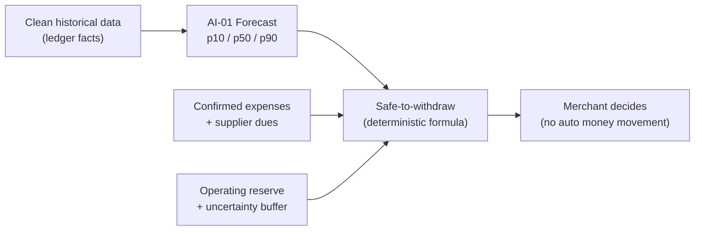
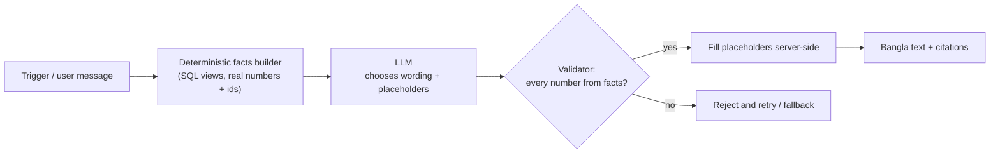

# 08 — AI / ML Specification

## 1. Position

The team's decision (Oct 2026): **AI is used across the product, not in one place** — for predictions, KPIs, sheets/reports, payment matching, briefings and an assistant — while **money truth stays deterministic**. This file reconciles the earlier "single forecasting engine" scope with that decision:

```text
          ┌──────────────── Deterministic core (never AI) ────────────────┐
          │ ledger · balances · settlement · refunds · fees · permissions │
          │ closing totals · safe-to-withdraw formula · audit             │
          └───────────────▲───────────────────────────────┬───────────────┘
                          │ clean facts                    │ facts JSON
          ┌───────────────┴──────────┐        ┌────────────▼─────────────┐
          │ Predictive ML (Python)   │        │ Language AI (LLM gateway) │
          │ forecast · float · match │        │ briefing · assistant ·    │
          │ anomaly · offer uplift · │        │ voice/text parse · report │
          │ churn (admin)            │        │ builder · KPI explanation │
          └──────────────────────────┘        └──────────────────────────┘
                     ↓ advice only, with confidence, reasons, and fallback ↓
                                 Owner decides
```

**Pitch line:** *"We use ML where the future is uncertain and language AI where people need plain Bangla — but every taka shown is computed by auditable rules."*

## 2. AI capability catalogue

| ID | Capability | Users | Type | Tier |
|---|---|---|---|---|
| AI-01 | 7-day sales & cash-flow forecast (p10/p50/p90, cash vs digital) | Merchant | ML (LightGBM quantile + baselines) | **MVP** |
| AI-02 | Agent float & cash-demand forecast (hourly, 24 h) | Agent | ML (quantile GBM / seasonal) | **MVP** |
| AI-03 | Smart reconciliation match suggestions | Merchant, Agent | ML ranker + rules | **MVP** |
| AI-04 | Transaction anomaly flags ("review needed") | Merchant, Agent, Support | Unsupervised + rules | **MVP** |
| AI-05 | Daily AI briefing (Bangla) | Merchant, Agent | LLM over facts | **MVP** |
| AI-06 | Bangla AI assistant (text + voice), read-only | Merchant, Agent, Staff (scoped) | LLM + tools | **MVP** |
| AI-07 | Voice / free-text entry parsing | Merchant, Agent | STT + LLM/regex parser | **MVP** |
| AI-08 | Expense auto-categorization | Merchant | Classifier / LLM | **MVP** |
| AI-09 | Offer advisor + incremental-impact measurement | Merchant, Agent | Stats + rules + LLM text | **MVP (lite)** |
| AI-10 | KPI & business-health explanation | Merchant, Agent | Deterministic KPIs + LLM narrative | **MVP** |
| AI-11 | AI report/sheet builder (natural language → report) | Merchant, Agent | LLM intent → enum templates | **MVP** |
| AI-12 | Baki reminder prioritization | Merchant, Agent | Scoring model | P1 |
| AI-13 | Supplier payment prioritization (when cash is tight) | Merchant | Optimization + explanation | P1 |
| AI-14 | Supplier invoice OCR → draft payable | Merchant | Vision OCR + LLM | P2 |
| AI-15 | Support copilot (case summary, evidence checklist, draft reply) | upay Support | LLM | P1 |
| AI-16 | Merchant/agent dormancy & churn risk | upay Admin | ML classifier | P1 |
| AI-17 | Privacy-safe peer benchmarking (k ≥ 20) | Merchant | Aggregates | P2 |
| AI-18 | Smart notification timing | All | Bandit / rules | P2 |

Hackathon demo shows **11 AI capabilities (AI-01 … AI-11)**, each with a visible card and a "Why?" explanation.

## 3. Standard contract for every AI output

Every AI output is stored in `ai_outputs` and rendered with five parts:

| Part | Example |
|---|---|
| What | "Cash-out demand likely high 4–7 pm" |
| Why | "Last 4 Thursdays averaged Tk 41,000 cash-out in this window; today is the 1st (salary)" |
| Data used | "Your last 56 days, 2,310 transactions" |
| Confidence | High / Medium / Low (calibrated, §9) |
| Action | "Keep ≥ Tk 40,000 cash" + button to Float screen (no automatic action) |

And: model/prompt version, input hash, latency, feedback buttons.

---

## 4. AI-01 — Seven-day sales & cash-flow forecast

### 4.1 Target
Daily net sales for D+1…D+7, split into digital (verified QR) and cash (recorded), per business. Output quantiles p10, p50, p90.

### 4.2 Features
| Group | Features |
|---|---|
| Calendar | day of week, weekend (Fri/Sat in BD), day of month, month-start (1–7) salary flag, month-end, public holiday, Ramadan day index, Eid −7…+3 window, Pohela Boishakh, exam season (campus), merchant closed day |
| Lags | sales D−1, D−7, D−14, D−28; same-weekday mean of last 4 |
| Rolling | mean/median/std over 3, 7, 14, 28 days; EWMA |
| Mix | digital share 7/28 d, avg ticket, txn count, refund rate |
| Business | category, location type, opening hours, outlet count (static) |
| Events | active offer flag, merchant-marked unusual days |
| Data quality | missing days in last 28, days since last closing, % manual entries |

### 4.3 Models
1. **Baselines:** last value; 7-day mean; seasonal naive (same weekday last week); seasonal mean of last 4 same weekdays; trend-adjusted seasonal mean.
2. **Global LightGBM quantile models** (α = 0.1, 0.5, 0.9) trained across all businesses with business-level features (global models work better with short individual histories).
3. **Optional**: Prophet / ETS per business with ≥ 120 days (compare only).
4. **Calibration**: split-conformal adjustment of p10/p90 on validation residuals per segment so that empirical 80% interval coverage ≈ 80%.
5. **Selection rule:** model used only if it beats best baseline on WAPE by ≥ 5% on the clean test set **and** interval coverage within 75–85%. Otherwise the baseline is served (and the UI still works).

### 4.4 Cold start
| History | Behaviour | Confidence cap |
|---|---|---|
| 0–13 days | Abstain (show "not enough history yet") or category baseline scaled by owner's typical-day estimate, clearly labelled | Low |
| 14–27 days | Seasonal mean baseline, wide intervals | Low/Medium |
| 28–55 days | Global model with merchant lags | Medium |
| ≥ 56 days | Full model | High possible |

Abstain also when: > 30% of last 14 days missing, no closing in 7 days, or drift alarm (§12).

### 4.5 Drivers explanation
Top 3 SHAP contributions translated into Bangla templates such as: "Friday is usually your busiest day", "start of month — salary time", "sales rose 12% last week".

### 4.6 Refresh
Nightly (02:00 Asia/Dhaka), after daily closing, after a large payable is confirmed, or manual refresh (≤ 3/day).

## 5. AI-02 — Agent float & cash-demand forecast

- **Targets:** hourly net cash demand (cash-out − cash-in) and e-float demand for next 24 opening hours; p50/p90.
- **Features:** hour, weekday, day-of-month (salary 1–7), remittance days, Eid/festival window, market (haat) day, last 4 same-hour values, today's running totals (nowcast).
- **Model:** global LightGBM quantile on hourly data; fallback = median of same hour, same weekday, last 4 weeks.
- **Advice rule (deterministic over forecast):** `needed_cash_by(h) = Σ p90 net cash-out from now to h`; if `drawer_cash − needed_cash_by(h) < agent_min_cash` → "Keep ≥ Tk X cash by time h". Similar for e-float: "At current pace e-float may run out ≈ 15:30".
- **Metrics:** hourly WAPE, p90 coverage, "stock-out hours avoided" in backtest.

## 6. Safe-to-withdraw (deterministic, uses AI-01 output)

### How forecast feeds deterministic planning




```text
For each day d in D0..D+7:
  projected_balance_p10(d) = cleared_balance_now
                           + Σ inflow_p10(D1..d)            # conservative forecast
                           − Σ confirmed_expenses(D0..d)
                           − Σ confirmed_supplier_dues(D0..d)
                           − dispute_refund_hold
lowest = min_d projected_balance_p10(d)
buffer = { high: 0, medium: 5% × Σ inflow_p10 up to the lowest day, low: → no recommendation }
safe_to_withdraw = max(0, lowest − operating_reserve − buffer)
shortfall        = max(0, operating_reserve − lowest)
```

- `cleared_balance_now` = upay wallet (verified) + counted cash at last closing ± today's recorded cash movements. Manual other-wallet balances are **excluded** by default (toggle with warning).
- `operating_reserve` default = 3 × average daily operating expense (owner-editable).
- Limitations shown: excludes unrecorded cash sales, other bank accounts, tax, salaries not entered, personal expenses.
- What-if (`/planner/simulate`) re-runs this formula with modified inputs; **never** calls a model.

## 7. AI-03 — Smart reconciliation

- **Candidates:** open invoices/orders/baki for the business within ±72 h and ±20% amount (configurable).
- **Features:** |amount diff|, relative diff, time gap, reference string similarity (Jaro-Winkler / token overlap after normalizing Bangla/English digits), same staff/counter, customer repeat link (payer_hash, consented), invoice age, typical payment delay for the customer.
- **Model:** hackathon — weighted logistic score trained on synthetic labelled pairs; production — LightGBM ranker (LambdaMART) on accepted/rejected decisions.
- **Policy:** exact reference + exact amount → auto-match (rule, not AI). Score ≥ 0.85 and margin ≥ 0.2 over second → "Suggested" (needs tap). Below → review queue without suggestion. **Never auto-matches an ambiguous case.**
- **Metrics:** precision@1 ≥ 90% at suggestion threshold; acceptance rate; time-to-reconcile.

## 8. AI-04 — Anomaly flags

| Layer | Detects |
|---|---|
| Rules (deterministic) | duplicate (same amount+payer+60 s), amount > 5× p99 for business, activity outside opening hours, refund > 3× 30-day daily mean, manual entries edited/reversed repeatedly by one staff, closing variance streak |
| Statistical | robust z-score (median/MAD) per hour & type; agent split-transaction pattern (many just-below-limit txns from same payer_hash) |
| ML | Isolation Forest on per-day business feature vectors (counts, mix, refund rate, variance, late-night share) |

Output: score + **reason codes** in Bangla; label is always "needs review", never "fraud". Support sees aggregated high-score list; no automatic blocking. Target: ≤ 2 alerts/business/week at pilot (alert fatigue budget).

## 9. Confidence calibration

Confidence label derived from measured performance, not a guess:

| Label | Rule (forecast) |
|---|---|
| High | ≥ 56 days data, segment rolling WAPE ≤ 20%, interval coverage 75–85%, no drift |
| Medium | ≥ 28 days, WAPE ≤ 35% |
| Low | otherwise (or abstain) |

For classifiers (match, anomaly): calibrated probabilities (isotonic) and thresholds tuned on validation; label shown only above thresholds.

## 10. AI-09 — Offer advisor & impact

- **Advise:** find slow day-parts (lowest p50 relative to weekly mean), customer base size with consent, past offer performance; suggest type/day/budget with expected uplift **range** from category priors (documented assumption) — clearly "estimate".
- **Measure (honest ROI):** compare offer days vs matched control days (same weekday, pre-period) with difference-in-differences; where possible hold out 10% of opted-in customers (no offer on receipt). Report incremental sales interval and cost; if interval includes 0 → show "impact not certain".
- **Guardrails:** no targeting by sensitive data; no manipulative urgency; merchant-funded; budget cap.

## 11. Language AI (AI-05, 06, 07, 08, 10, 11, 15)

### Facts-first LLM pipeline (no hallucinated numbers)




### 11.1 Architecture: facts first, LLM second
```text
User/Trigger → Deterministic "facts builder" (SQL views) → facts JSON (numbers, ids)
            → LLM (prompt vN) → draft text with placeholders {{f.today_sales}}
            → Validator: every number in output must come from facts; templates filled server-side
            → Bangla text + citations → user
```
The LLM never computes money; it chooses wording and which facts to mention. Numbers are injected after generation, so hallucinated amounts are impossible.

### 11.2 Assistant tools (read-only, business-scoped by server)
`get_sales_summary(period)`, `list_transactions(filters)`, `get_review_queue()`, `get_payables(due_before)`, `get_baki_summary()`, `get_forecast()`, `get_safe_to_withdraw()`, `simulate(params)`, `get_kpis()`, `get_float()`, `get_offer_results(id)`, `open_screen(route)` (returns deep link). No write tools. Tools run with the user's JWT → RLS applies (staff get only their own data).

### 11.3 Guardrails
- System prompt: role, Bangla-first, refuse money movement, refuse legal/tax/loan advice (point to proper channel), cite data, say "I don't know" when tools return nothing.
- **Prompt-injection defence:** user-controlled text (notes, supplier names, references, customer names) is passed as *data* in delimited fields, never instructions; tool outputs sanitized; no tool can reach outside the business.
- PII minimization: phone numbers masked; payer identities never sent; business name replaced with alias in prompts where possible.
- Output filters: number validator, profanity/harm filter, length cap.
- Per-business daily LLM budget; caching of briefing; small model for parse/intent, larger model for assistant.

### 11.4 AI-05 briefing example (facts → output)
```json
{"yesterday_sales": 1840000, "digital_share": 0.39, "unmatched": 2,
 "next_due": {"supplier": "Rahman Traders", "amount": 1500000, "date": "2026-10-04"},
 "safe_to_withdraw": 600000, "forecast_week_p10": 9600000, "forecast_week_p90": 11200000}
```
> *(rendered in Bangla)* **Good morning, Karim.** Yesterday's sales Tk 18,400 (39% digital). 2 payments still need matching. Rahman Traders is due Tk 15,000 on Saturday. This week roughly Tk 96,000–Tk 1,12,000 may come in. Up to Tk 6,000 is safe to withdraw today.

### 11.5 AI-07 parse
A Bangla utterance meaning "five hundred taka cash sale, biscuits" → `{kind: CASH_SALE, amount_minor: 50000, category: "Snacks", confidence: 0.94}`. Pipeline: STT (Bangla) → number normalizer (Bangla words/digits → integer, handles half/thousand/lakh word forms) → rule parser → LLM fallback with JSON schema. Always shown as a draft for confirmation.

### 11.6 AI-11 report builder
LLM maps request to `report_key ∈ {daily_closing, sales_by_day, sales_by_category, cash_vs_digital, expenses, supplier_dues, supplier_payments, baki, refunds_disputes, offers, agent_book, commission, kpi_summary}` + filters (date range, category, supplier) via JSON schema (enum-constrained). Report SQL is predefined. Output preview → export.

### 11.7 AI-10 KPI explanation
KPIs computed in SQL (file 03 §M12). LLM writes ≤ 2 sentences per red/yellow KPI citing the formula inputs, e.g. (in Bangla) "Supplier pressure is high: Tk 45,000 due in the next 7 days, estimated available Tk 52,000."

## 12. Evaluation plan

### 12.1 Data split
Time-based: first 70% train, next 15% validation, last 15% clean test; rolling-origin backtest (7 folds) for forecasts. No future leakage (features computed with cutoff).

### 12.2 Metrics & targets (synthetic → pilot)
| Capability | Technical metric | Target | Business metric |
|---|---|---|---|
| AI-01 | WAPE, MAE, bias, 80% PI coverage | WAPE −10% vs best baseline; coverage 75–85% | Cash-shortage days in backtest simulation, avoidable withdrawals |
| AI-02 | Hourly WAPE, p90 coverage | coverage ≥ 85% | Float stock-out hours avoided |
| AI-03 | Precision@1, coverage | ≥ 90% / ≥ 60% | Minutes to reconcile per day |
| AI-04 | Precision on injected anomalies, alerts/business/week | ≥ 70%, ≤ 2 | Variance reduction |
| AI-05/10 | Number-fidelity (must be 100%), human rating (clarity) | 100% / ≥ 4/5 | Briefing open rate |
| AI-06 | Tool-call accuracy, answer correctness on 100-question Bangla test set, refusal correctness | ≥ 90%, ≥ 90%, 100% | Assistant usage, deflected support |
| AI-07 | Exact-parse accuracy on 200 utterances | ≥ 90% | Time per entry |
| AI-09 | Interval validity (synthetic ground truth) | covers true uplift ≥ 80% | Offer ROI |
| AI-11 | Intent accuracy | ≥ 95% | Reports generated |

### 12.3 Baseline comparison table (fill from experiments)
| Model | WAPE | Bias | PI coverage | Shortage-day detection | Note |
|---|---:|---:|---:|---:|---|
| Seasonal naive | … | … | n/a | … | baseline |
| 4-week same-weekday mean | … | … | … | … | baseline |
| LightGBM quantile (global) | … | … | … | … | candidate |
| + conformal calibration | … | … | … | … | final if best |

## 13. MLOps

| Concern | Practice |
|---|---|
| Versioning | `model_version` (semver + git sha), `feature_version`, `prompt_version` on every output |
| Registry | Hackathon: versioned files in object storage + `models.json`; production: MLflow |
| Training | Weekly retrain (production), manual approval gate; never auto-retrain from a single user's feedback |
| Shadow mode | New model runs in parallel, outputs hidden; promoted after 14 days if metrics better |
| Monitoring | Rolling WAPE, coverage, bias by segment (category, location, history length) ; data-quality checks; feature drift (PSI > 0.2 alarm); LLM: refusal rate, validator rejections, latency, cost |
| Fairness check | Error by segment (new vs old merchants, rural vs urban, agent vs merchant); cold-start segments get wider intervals, never hidden higher risk |
| Kill switches | per capability flag; fallback paths tested in CI |
| Reproducibility | inputs hashed; training data snapshot ids; seeds fixed |

## 14. Responsible AI rules

1. **Advice only.** No AI output triggers money movement, account restriction, credit decision or customer contact.
2. **No credit scoring / loan eligibility** from BizFlow data in this product.
3. **No hidden profiling.** No "good/bad merchant" labels; health is transparent KPIs.
4. **Uncertainty shown** (ranges, confidence, abstention).
5. **Explainability** (why + data used) on every card.
6. **Contestability**: mark unusual days, correct data, no feedback with reason; support can review.
7. **Data minimization & consent**: payer identities hashed; loyalty requires opt-in; training data pseudonymized; no raw PII to LLM providers.
8. **Human oversight**: Super Admin AI-health dashboard; incident process for harmful outputs.

## 14a. Delivery: the Today's Insights layer (see docs/14)

The capabilities above are not surfaced as a chatbot. After login the home screen is a
role-scoped "Today's Insights" feed, assembled by `today_insights(business_id)`:

- It is scoped by business type. A Merchant feed draws on the sales forecast (`get_forecast`
  with capability `sales7d`), cash-flow (`get_safe_to_withdraw`), supplier dues, KPI mix,
  anomaly flags and pending settlements. An Agent feed draws on the float forecast
  (`float24h`), a liquidity read of cash versus forecast demand, agent peak-hour expectation
  (`agent_peak_hours`), anomaly and pending. Customer activity and a yesterday summary appear
  for both, aggregate only.
- Cross-role output is impossible: `get_forecast` rejects a capability that does not match the
  business type, `_assert_business_type` guards the role-specific RPCs, and the role-scoped
  fact views filter by `businesses.type`.
- Every figure comes from the ledger or a facts view; the Bangla and English text is a
  deterministic template around it, so the "the LLM never computes a number" rule holds with
  no model call. `agent_peak_hours` abstains below a minimum of history rather than guessing.

## 15. Model cards (one per capability, kept in repo)

Template: purpose · intended users · out-of-scope uses · training data (synthetic/pilot, period) · features · metrics by segment · known limitations · fallback · owner · last review date.

---

## 16. Update: October 2026 UI redesign (how AI is shown)

- AI output appears in one place on Home: a slim strip showing one insight at a time
  (severity icon + word, title, one-line body, `1/4` pager). It is never the largest
  element; balances and actions come first.
- Tapping opens the insights sheet: every card, its status word, and a "Why?" view that
  lists the card's facts, with the note that numbers come from the books and the AI only
  phrases them.
- No pulsing, glowing or animated AI elements; a new insight fades in once (docs/16
  section 8).
- The Notifications screen reuses the same cards.
- The no-backend demo generates insight cards deterministically from its ledger, so the
  "AI never computes numbers" rule holds there too.
