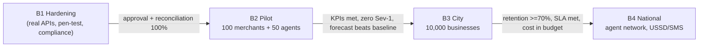

# 10 — Implementation Roadmap (Phased)

Two horizons:
- **Part A — Hackathon build** (≈ 18–20 focused hours, AI-assisted coding). Phases are ordered so that the app is demo-able after every phase.
- **Part B — Production path** (Pilot → City → National).

Use `13-ai-build-playbook-and-skills.md` for the exact prompts per phase.

---

# Part A — Hackathon build

## A.0 Definition of done (demo)

On a phone (and web link), in Bangla:
1. Merchant logs in → Home with real-looking numbers and AI card.
2. Judge "pays" Tk 850 via simulator → banner + sound → receipt link with stamp-card progress.
3. Cash sale by voice; expense; supplier due visible.
4. Match suggestion accepted; anomaly flag explained.
5. Daily closing with variance → closing receipt.
6. Planner: 7-day forecast band, safe-to-withdraw formula, what-if "withdraw Tk 15,000".
7. Switch to Agent → book of cash-in/out/send money, float audit, float advice.
8. Offer created with advisor; results card.
9. Assistant answers 3 Bangla questions with citations; report builder exports a sheet.
10. Admin web: portfolio KPIs, AI health, kill switch demo (turn off forecast → fallback shown).

## A.1 Phase plan

### Hackathon phase timeline

```mermaid
gantt
    title BizFlow Hackathon Build (approx 18.75 hours)
    dateFormat HH
    axisFormat %Hh
    section Foundation
    P0 Setup            :p0, 00, 1h
    P1 Data core        :p1, after p0, 2h
    P2 Auth and shell   :p2, after p1, 1h
    section Money flows
    P3 Payments+receipts:p3, after p2, 2h
    P4 Merchant books   :p4, after p3, 3h
    P5 Agent            :p5, after p4, 2h
    section Intelligence
    P6 Predictive AI    :p6, after p5, 3h
    P7 Language AI      :p7, after p6, 2h
    P8 Planner+offers   :p8, after p7, 2h
    section Finish
    P9 Admin web        :p9, after p8, 1h
    P10 Harden+demo     :p10, after p9, 2h
```

| Phase | Time | Build | Done when |
|---|---|---|---|
| **P0 Setup** | 0:45 | Monorepo (pnpm/Turbo), Expo SDK 56 app with Router + NativeWind + i18n (bn), Supabase project (local + cloud), FastAPI skeleton, GitHub repo + CI lint/test, `.env` handling, install agent skills | App runs on phone (Expo Go/dev build) and web; `supabase start` ok; `/v1/health` ok |
| **P1 Data core** | 2:00 | Migrations: tenancy, memberships, accounts, transactions, journal, payment_events, receipts, closings, suppliers/payables, customers/baki, offers, ai_outputs, audit, flags. RLS + helper functions. RPCs: `create_business`, `post_cash_sale`, `post_expense`, `post_payment`, `post_manual_wallet`, `correct_transaction`. Balanced-entry trigger, append-only triggers. Seed script with 180 days synthetic data (12 merchants, 6 agents) | pgTAP tests: balanced entries, no UPDATE/DELETE, cross-tenant denied |
| **P2 Auth & shell** | 1:00 | Phone OTP (Supabase test OTP for demo), PIN setup, membership → route group (merchant/agent/staff), Shop⇄Agent switch, tab bars, design tokens, `MoneyText`, `StatusPill`, `AICard` | Login → correct tabs per role |
| **P3 Payments & receipts** | 1:30 | Edge Functions: `payment-webhook` (HMAC, idempotent), `simulator/pay`; Realtime banner + sound; Transactions inbox with filters & statuses; receipt page `/r/[token]`; dynamic QR screen | Simulated payment appears < 2 s with receipt |
| **P4 Merchant books** | 2:30 | Quick cash sale keypad, expense, baki (gave/received), suppliers & payables, review queue (exact match), daily closing (preview → count → variance → receipt → reopen) | Closing receipt matches ledger; variance posts to 9000 |
| **P5 Agent** | 1:30 | Agent book (type chips), manual other-wallet entries, float screen (verified vs manual), day-end audit (cash + per-wallet), commission view | Agent close shows correct expected cash after cash-in/out mix |
| **P6 Predictive AI** | 2:30 | Synthetic generator + data dictionary; baselines; LightGBM quantile (sales7d + float24h); conformal calibration; evaluation notebook → metrics table; match scorer; anomaly rules + IsolationForest; endpoints; DB jobs writing `forecast_runs`/`ai_outputs` | Metrics table filled; app shows forecast band & float advice; fallback works when service is off |
| **P7 Language AI** | 2:00 | LLM gateway, facts builders (SQL views), briefing, assistant with read-only tools + citations, voice/text parse (STT + number normalizer), expense auto-categorize, report builder (enum intents) + CSV/XLSX export, KPI explanations, number validator, injection tests | 20-question Bangla test set ≥ 90% correct; validator rejects fabricated numbers |
| **P8 Planner & offers** | 2:00 | Safe-to-withdraw RPC (lowest-day algorithm), what-if simulate, Planner UI; offers CRUD + receipt rendering + stamp cards + budget cap; offer advisor + results (DiD) | What-if shows shortage day; offer auto-pauses at cap |
| **P9 Admin web** | 1:00 | `/admin`: portfolio KPIs, support case list with SLA timers, access-grant flow, AI health (metrics from `ai_outputs`/evaluations), feature flags & kill switches | Turning off `ai.forecast` instantly shows baseline label in app |
| **P10 Harden & demo** | 2:00 | Security checklist (file 09 §9), E2E happy-path tests, empty/error/offline states, performance pass, demo accounts reset script, screen recording, pitch deck, README | Full demo script runs twice without intervention |

**Total ≈ 18¾ h.** Two people in parallel (frontend/UI + backend/AI) cut wall-clock to ≈ 10–11 h.

## A.2 Parallel tracks

| Track | Owner suggestion | Phases |
|---|---|---|
| UI/Frontend | Mahabub (+ Adiba review at P2, P4, P10) | P2, P3 (UI), P4, P5, P8 (UI), P9 |
| Backend/DB | Mahabub (AI-assisted) | P1, P3 (functions), RPCs for P4/P5/P8 |
| AI/ML | Mahabub / teammate | P6, P7 |
| Product/Design/Pitch | Adiba | UI review checklist, microcopy, deck, demo script, video |

## A.3 Cut-line (if time runs out, drop in this order)
1. AI-17/18 and all P2 items (already excluded)
2. Baki reminders drafts → keep baki list only
3. Report export to XLSX → CSV only
4. Offer results DiD → show redemptions + cost only
5. Voice STT → text parse only
6. Admin support console → keep portfolio + AI health + flags

**Never cut:** ledger integrity, RLS, closing, forecast with fallback, receipts, safe-to-withdraw formula visibility.

## A.4 Demo data & accounts

| Account | Phone (test OTP) | Role |
|---|---|---|
| Karim Store (campus grocery) | 01700000001 | merchant_owner |
| Rahim Agent Point | 01700000002 | agent_owner |
| Karim also agent (switch demo) | 01700000001 | agent_owner on 2nd business |
| Shila (staff) | 01700000003 | staff |
| Support Nafis | admin email | upay_support |
| Product lead | admin email | upay_admin |

`pnpm demo:reset` re-seeds and sets "today" to the demo date so numbers match the script.

---

# Part B — Production path

## B.1 Phase overview

### Production rollout gates

| Phase | Duration | Scope | Exit gate |
|---|---|---|---|
| **B1 Hardening** | 6–8 weeks | Real upay acquiring & agent event integration (sandbox), TSI, settlement file reconciliation, refund API, KYC registry link, pen-test, MASVS review, DPIA, Legal/Compliance sign-off, in-country hosting | Security & compliance approval; reconciliation 100% on sandbox volume |
| **B2 Pilot** | 3 months | 100 merchants (campus + neighbourhood) + 50 agents in 2 areas; forecast in **shadow mode** first 4 weeks; field officer onboarding; weekly UX research | KPIs (§B.3) met; zero Sev-1; forecast beats baseline in real data |
| **B3 City** | 6–9 months | 10,000 businesses Dhaka & Chattogram; SMS summaries; supplier OCR; support copilot; churn model for admin; partitioning & read replica | 90-day retention ≥ 70%; support SLA met; cost/user within budget |
| **B4 National** | 12+ months | Agent-network rollout via distributors; USSD/SMS for feature phones; multi-outlet; sharding; OLAP; peer benchmarking (k ≥ 20); partner services (with explicit consent & regulation) | Default upay merchant/agent experience |

## B.2 Workstreams in production

| Workstream | Key deliverables |
|---|---|
| Integration | upay acquiring events, agent platform feed, refund/dispute APIs, NPSB DMS status sync |
| Platform | In-country Postgres HA, PITR, DR site, observability stack, SRE on-call |
| Security & compliance | Pen-test, ISMS controls mapped to BB ICT guideline, DPIA under PDPO, vendor DPAs, audit readiness |
| AI | Real-data retraining, shadow → canary → full, segment fairness reviews, LLM cost controls |
| Field & support | Field officer app, Bangla video tutorials, QR standees with tamper seal, support playbooks with BB dispute timelines |
| Growth | Referral program, upay campaign tools, merchant success team |

## B.3 Pilot KPIs (targets to validate)

| KPI | Target |
|---|---|
| Weekly active owners | ≥ 60% |
| Days closed per week (active) | ≥ 4 |
| Median day-end variance | −50% vs. week 1 |
| Digital sales share | +10 pp vs. baseline |
| Wallet balance retention (merchant) | +15% vs. control group |
| Agent float stock-out events (self-reported/logged) | −30% |
| Forecast WAPE vs baseline | ≥ 10% better |
| Assistant answer accuracy (audited sample) | ≥ 90% |
| NPS | ≥ 40 |

## B.4 Risks & mitigations

| Risk | Mitigation |
|---|---|
| upay API access delayed | Adapter + simulator; pilot with settlement-file ingestion first |
| Low digital literacy | Voice, Bangla-first, field onboarding, 3-action Home |
| Forecast inaccurate for small/new shops | Abstention, wide intervals, baseline fallback, shadow mode |
| LLM cost/latency | Facts-first, caching, small models, budgets |
| Regulatory change | Config-driven timelines, Legal review each release |
| Competitor copies features | Speed + upay data integration + agent book + trust (append-only, audit) as moat |
| Data residency for cloud services | In-country hosting plan from B1; LLM only sees pseudonymized facts |
