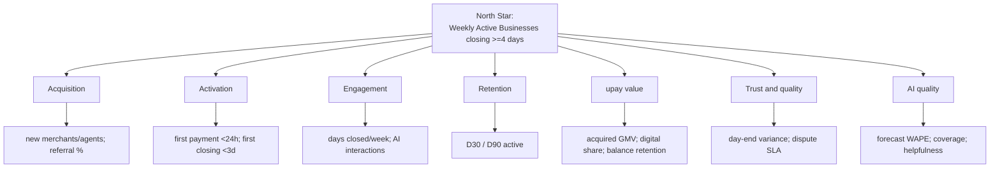

# 12 — Business Model, KPIs & Pitch

## 1. Business logic for upay

### Value loop


```text
Better tools for merchants & agents
   → more choose upay as QR acquirer / stay active
   → more Bangla QR volume acquired by upay (+ NPSB acquirer incentive)
   → more money stays in upay wallets (less cash-out)
   → stickier relationships (their books live in BizFlow)
   → channel for future UCB/partner services (with consent & regulation)
```

## 2. Pricing model

| Tier | Price | Includes |
|---|---|---|
| **BizFlow Free** (default for all upay merchants/agents) | Tk 0 | QR, receipts, auto book, cash/expense entry, baki, suppliers, daily closing, basic AI (briefing, forecast, assistant with daily cap), offers (1 active) |
| **BizFlow Plus** (future) | e.g. Tk 199–Tk 499/month (test in pilot) | Multiple staff/outlets, unlimited offers & assistant, advanced reports & exports, SMS receipts bundle, OCR, priority support |
| upay-funded | — | Campaigns to acquire merchants/agents in target areas |

Free tier is the acquisition engine; Plus monetizes larger shops. Hackathon: show economics only.

## 3. Economics model (all inputs editable — illustrative only)

### 3.1 Formulas
```text
Incremental acquired GMV/yr = Merchants × QR txns/day × Avg ticket × Open days × Share newly acquired by upay
NPSB acquirer incentive/yr  = Eligible GMV × 0.10%   (txns ≤ Tk 2,000; eligibility per BB rules)
Retained wallet balance     = Merchant digital GMV × Avg days held × Retention uplift
Value of retained balance   = Retained balance × upay funding/treasury yield
Plus revenue/yr             = Merchants × Plus adoption × Price × 12
Net value                   = Incentive + Balance value + Plus revenue + Agent-volume value
                              − Tech cost − Support cost − Field cost − Campaign cost
```

### 3.2 Illustrative scenario (City phase, 10,000 merchants)
| Input | Assumption |
|---|---|
| QR txns/day/merchant | 40 |
| Avg ticket | Tk 300 |
| Open days/yr | 330 |
| Share newly acquired by upay due to BizFlow | 50% |
| → Incremental acquired GMV/yr | 10,000 × 40 × 300 × 330 × 0.5 = **Tk 1,980 crore** |
| → Acquirer incentive at 0.10% | **≈ Tk 1.98 crore/yr** |
| Plus adoption 5% × Tk 299 × 12 | **≈ Tk 17.9 lakh/yr** |

These numbers are **assumptions for discussion**, not forecasts. The in-app/slide calculator lets judges change every input.

### 3.3 Merchant value (why they stay)
```text
Merchant monthly value = Time saved on reconciliation (min/day × days × value of time)
                       + Avoided cash shortages / late supplier penalties
                       + Reduced day-end variance (leakage)
                       + Incremental repeat sales from offers − offer cost
```
Pilot measures each term.

## 4. KPI tree




```text
North Star: Weekly Active Businesses that closed ≥ 4 days (WAB-4)
├── Acquisition: new merchants/agents on BizFlow; % via referral; onboarding completion
├── Activation: first payment received in 24 h; first closing in 3 days
├── Engagement: days closed/week; AI card interactions; assistant questions; offers created
├── Retention: D30/D90 active; churn risk list resolved
├── upay value: acquired QR GMV; digital share; wallet balance retention; cash-out ratio; agent volume
├── Trust & quality: day-end variance; dispute resolution within SLA; complaints per 1k txns
└── AI quality: forecast WAPE vs baseline; PI coverage; assistant accuracy; yes rate; fallback rate
```

| KPI | Formula |
|---|---|
| WAB-4 | Businesses with ≥ 4 closings in last 7 days |
| Digital share | Verified digital sales ÷ (digital + recorded cash sales) |
| Wallet balance retention | Avg end-of-day wallet balance ÷ avg daily digital inflow |
| Cash-out ratio (merchant) | Withdrawals to cash ÷ digital inflow |
| Closing adoption | Businesses closing ≥ 1×/week ÷ active businesses |
| Variance rate | Σ abs(variance) ÷ Σ expected cash |
| Dispute SLA | Disputes resolved within guideline timelines ÷ total |
| AI helpfulness | yes ÷ (yes + no) per capability |

## 5. Go-to-market

1. **Campus + neighbourhood pilot** (high frequency, tech-curious owners, strong word of mouth).
2. **Agent channel**: agents are trusted local nodes; agent book + float AI is the hook; agents then recommend upay QR to nearby shops (referral reward).
3. **Field officers** with onboarding app; 5-minute setup; QR standee with tamper seal.
4. **Bangla video tutorials** (30 s each) inside the app.
5. **upay campaigns**: co-funded first offers for new BizFlow merchants (budget-capped).
6. **Message** (shown in Bangla): *"Money from any app — your books stay in upay."*

## 6. Judging-criteria map (from team blueprint)

| Criterion | Weight | Our evidence |
|---|---|---|
| Problem relevance | 20% | BB data: cash-heavy MFS, 39 lakh QR points, Oct 2026 pricing reform commoditizes acceptance; clear personas (merchant + agent) |
| AI/ML depth | 20% | 11 AI capabilities with contract; quantile forecasting + conformal calibration + baselines + backtests; float forecast; ranker; anomaly; facts-first LLM with validator; metrics table; MLOps & kill switches |
| Business/customer impact | 20% | upay value chain, acquirer incentive, editable economics, KPI tree, pilot targets |
| Prototype quality | 15% | End-to-end live loop on phone + admin web; offline; Bangla; voice |
| Innovation | 10% | Post-payment operating layer; agent book + float AI; honest offer ROI; safe-to-withdraw with lowest-day algorithm |
| Scalability | 10% | Adapter architecture, partitioning/sharding plan, load math, phased rollout |
| Responsible AI & security | 5% | Deterministic money truth, abstention, RLS, append-only ledger, PDPO consent, BB dispute timelines |

## 7. Pitch narrative (5 minutes)

| Time | Slide / moment | Message |
|---|---|---|
| 0:00 | Hook | "Karim gets paid by bKash, Nagad, Rocket and upay all day. At 10 pm his drawer is Tk 300 short and he doesn't know why." |
| 0:30 | Problem + data | Cash-heavy MFS; 39 lakh QR points; since 1 Oct 2026 accepting QR is cheap & instant everywhere → providers can't compete on acceptance |
| 1:00 | Insight | Interoperability = merchants can choose any acquirer without losing customers. Win them with what happens *after* the payment. |
| 1:20 | Solution | BizFlow: auto books, receipts, daily closing, agent float audit, offers, AI guidance — Bangla-first |
| 1:40 | **Live demo** (2:30) | Pay → banner → receipt with stamp → voice cash sale → close day → forecast & safe-to-withdraw → what-if → switch to Agent → float advice → assistant question → admin kill switch |
| 4:10 | AI depth | 11 capabilities, metrics vs baseline, facts-first LLM, abstention |
| 4:30 | Impact & rollout | KPI targets, economics calculator, Pilot → City → National |
| 4:50 | Close | "Other wallets take the money. upay runs the shop." |

## 8. Demo script (exact clicks)

1. Phone A: logged in as **Karim Store**. Show Home (Tk 18,400; [OK]; card; 3 tasks).
2. Admin web → Simulator → pay Tk 850 from "bKash" → phone beeps, banner.
3. Tap banner → receipt → open link on Phone B (customer view, stamp 3/5).
4. Hold [mic]: say (in Bangla) "five hundred taka cash sale" → confirm.
5. Review queue → "Tk 2,450 → Invoice #1048, 92%" → Accept. Show anomaly "duplicate Tk 1,200 within 40 s" → reason.
6. Close day → counted Tk 12,000 → [WATCH] −Tk 300 → note → closing receipt.
7. Planner → band chart → safe-to-withdraw Tk 6,000 → "see the maths" formula → What-if Tk 15,000 → Saturday [ALERT].
8. Header switch → **Agent** → book with cash-in/out → Float → "Keep ≥ Tk 40,000 by 4 pm".
9. Assistant: ask (in Bangla) "which day this week had the lowest sales?" → answer + citations → "give last month's supplier sheet" → CSV.
10. Offers → Create stamp card → "Wednesday is slowest" → publish.
11. Admin web → Portfolio KPIs → AI health → toggle `ai.forecast` off → phone Planner shows "simple estimate (AI off)" → toggle on.

## 9. Q&A preparation

| Likely question | Answer |
|---|---|
| Why would a merchant leave bKash? | They don't need to — any customer app still pays them. They choose upay as acquirer because books, closing, agent audit and AI come with it. |
| Is the forecast accurate? | Shown as a range with confidence; beats baselines on held-out data by X%; abstains when data is thin; served baseline otherwise. |
| What if the AI is wrong? | It never moves money; formulas are visible; kill switch + fallback; owner decides. |
| Real integration? | Adapter with the same contract as upay's webhook; simulator today; TSI, settlement, refund APIs mapped. |
| Data privacy? | Payer identities hashed, consent for loyalty, RLS isolation, PDPO-aligned, in-country hosting plan. |
| Cost of LLM at scale? | Facts-first, cached briefings, small models for parsing, per-business budget; estimated per-user cost in file 05 §11. |
| How is this different from TallyKhata? | Automatic capture from upay payments, agent float audit, daily closing, AI forecast/safe-to-withdraw, dispute workflow — and it drives upay acquiring volume. |
